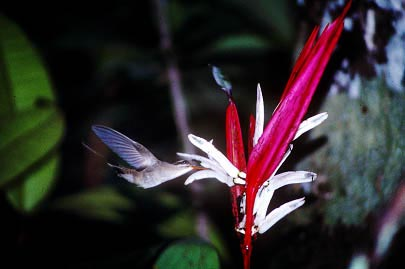

**_UPDATE:_** After a great year here in Gainesville, Rosinha has headed back to Brazil.  We miss her, but look forward to many more years of working together,

Dr. Maria Rosa Darrigo earned her PhD at UNICAMP, where she used integral projection models to study alternative harvesting strategies for tropical trees. She is in the lab as a Science Without Borders Postdoctoral Fellow; her research will look into how the loss of different avian seed dispersers influences plant demography in fragmented tropical landscapes. She'll be using data from the Biological Dynamics of Forest Fragments Project in Brazil, where we have been studying the population dynamics of _Heliconia acuminata_ and the movement and feeding of its dispersers.

\[caption id="attachment\_468" align="aligncenter" width="405"\] Heliconia acuminata is pollinated by Phaethornis hummingbirds.\[/caption\]
