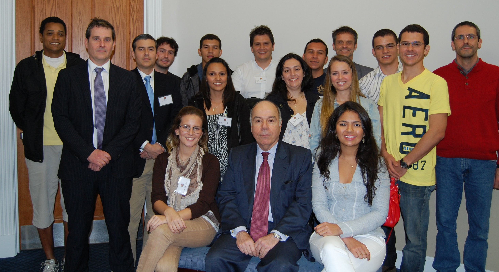

\[caption id="attachment\_615" align="aligncenter" width="2932"\] His Excellency Mauro Vieira, Brazil's Ambassador to the United States, met with Science Without Borders Participants during a conference at UF .\[/caption\]

During the Center for Latin America Studies' recent "Emergent Brazil" Conference, students, postdocs and faculty supported by the Science Without Borders Program had the opportunity to meet with Mauro Vieira, Brazil's  Ambassador to the United States and Ricardo Monteiro, Counselor from the Embassy's Commerce Section. The meeting was organized by the [Florida-Brazil Linkage Institute](http://www.floridabrazil.org) and was an amazing opportunity for the group to discuss with the Ambassador the importance of international collaboration and study abroad. It was also notable for being one of the rare opportunities to see Emilio wearing a tie.
