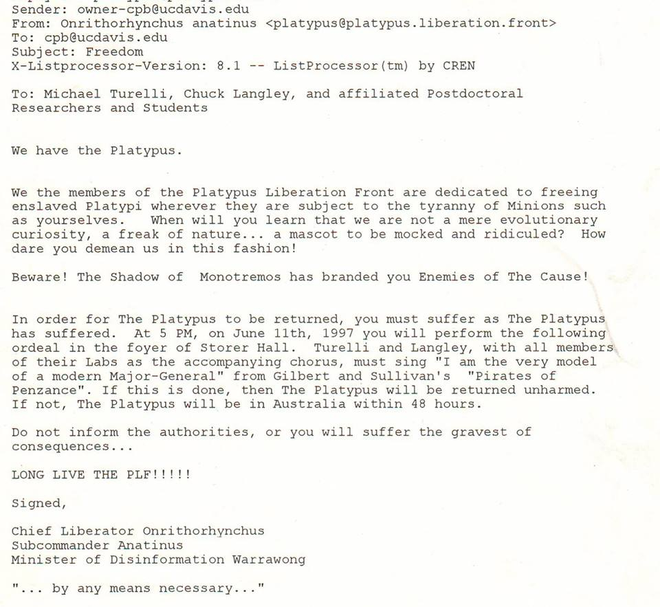
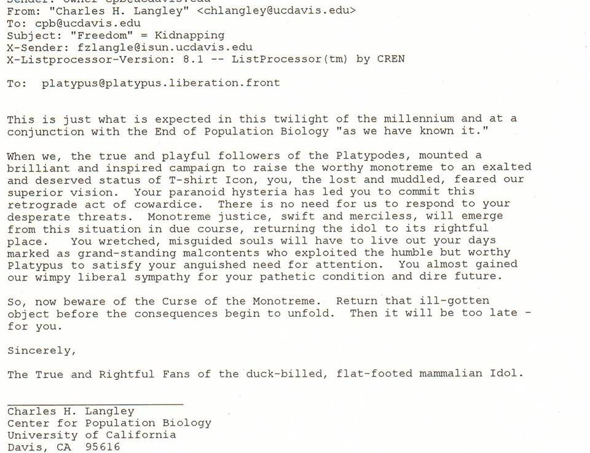
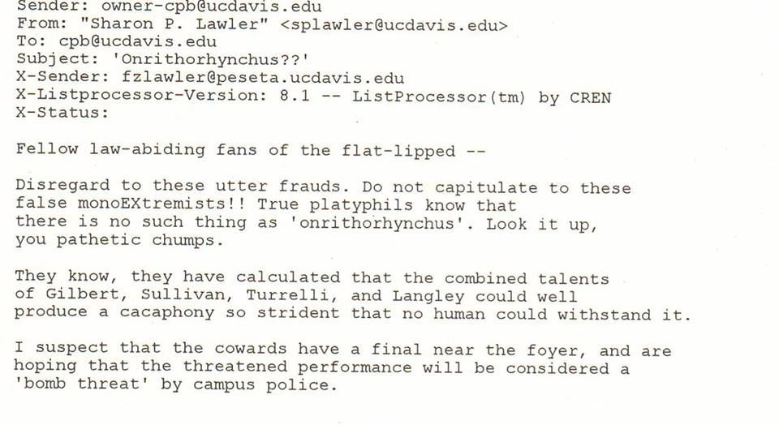
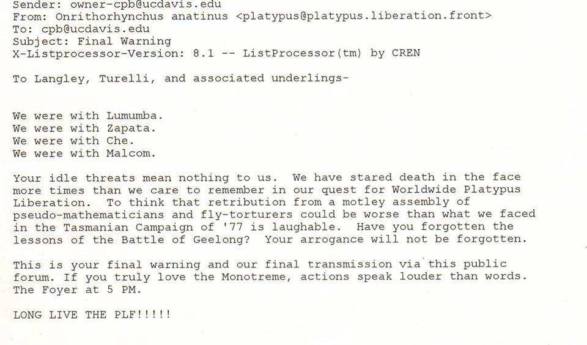
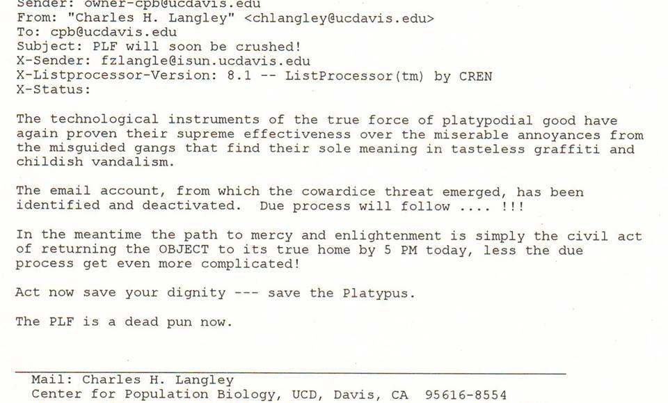

In 1997, the now respectable [Emilio Bruna](http://brunalab.org/emilio-m-bruna/), [Tag Engstrom](http://www.csuchico.edu/biol/personnel/engstrom/Engstrom%20web%20page.htm), and [James Umbanhowar](http://bio.unc.edu/people/faculty/umbanhowar/) kidnapped a platypus belonging to Michael Turelli, Charles Langley, and John Gillespie in response to the threat of it becoming the symbol of the [UC Davis Population Biology Graduate Group](http://cpb.ucdavis.edu/). Below is the correspondence that followed.

 

 

# **THE MANIFESTO**

# **LANGLEY RESPONDS**

# 

# **SHARON LAWLER CHIMES IN**

# **THE PLF DOUBLES DOWN**

# 

# **IT ENDS BADLY FOR THE PDF**

