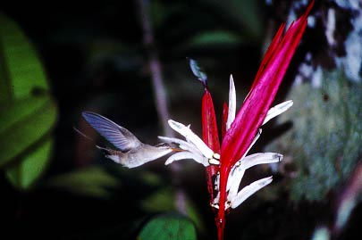
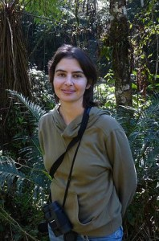

\[caption id="attachment\_468" align="aligncenter" width="405"\] _Heliconia acuminata_ is pollinated by _Phaethornis_ hummingbirds.\[/caption\]

Marina Côrtes did a supeb PhD in which she investigated the processes influencing spatial genetic structure in populations of _Heliconia acuminata_ at the Biological Dynamics of Forest Fragments Project in Manaus (her advisor was my friend and collaborator Dr. [Maria Uriarte)](http://www.columbia.edu/~mu2126/).  [One of papers from her dissertation has just come out in _Molecular Ecology_](http://wp.me/a32RIy-fp), and it is spectacular.

> We used Bayesian genetic analyses to characterize parentage and propagule dispersal in _Heliconia acuminata_ L. C. Richard (Heliconiaceae), a common Amazonian understory plant that is pollinated and dispersed by birds. We studied these processes in two continuous forest sites and three 1-ha fragments in Brazil’s Biological Dynamics of Forest Fragments Project. These sites  showed variation in the density of _H. acuminata_.Ten microsatellite markers were used to  genotype flowering adults and seedling recruits and to quantify realized pollen and seed dispersal distances, immigration of propagules from outside populations, and reproductive dominance among parents. We tested whether gene dispersal is more dependent on fragmentation or density of reproductive plants.

\[caption id="attachment\_964" align="alignleft" width="198"\] Dr. Marina Cortes\[/caption\]

The answer? You;'l have to read the paper to find out, but it really calls into question a dominant paradigm about how habitat fragmentation influences plant population genetic structure.

Dra. Marina is now a postdoc at UNESP, and you can find out more about her work [here](http://marinaccortes.wix.com/marina).
