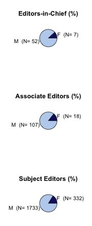

_Image: "Pen and Paper", by Orin Zabest._

 

##### This semester I taught a 1-unit [workshop on scientific publication](http://brunalab.org/wis6934/) for graduate students. As part of the workshop we studied how bias -- geographic, institutional, gender, etc. -- could influence the likelihood of getting published. 

##### In all my grad classes I assign a group project, and this year's was a follow-up to the discussion on bias.  I asked students to review the gender composition of the editorial boards of 10 journals and see how well women were represented among the Subject Editors as well as the 'editorial leadership' (i. e., Associate Editors, Editors-in-Chief).  This was actually something I'd started looking into last year with my former student [Irina Skinner](http://plaza.ufl.edu/irinas/Irina/Welcome.html) after the following twitter exchange with [Jonathan Eisen](http://phylogenomics.wordpress.com):

 

<blockquote class="twitter-tweet" lang="en">.<a href="https://twitter.com/phylogenomics">@phylogenomics</a> we work hard for diversity of gender &amp; geography on Biotropica's editorial board...hard but important. <a href="http://t.co/mChKKIb9">http://t.co/mChKKIb9</a>

— Emilio M. Bruna (@BrunaLab) <a href="https://twitter.com/BrunaLab/statuses/292048308640296960">January 17, 2013</a></blockquote> 

<blockquote class="twitter-tweet" lang="en" data-conversation="none"><a href="https://twitter.com/BrunaLab">@BrunaLab</a> have you ever written anything about that? — Jonathan Eisen (@phylogenomics) <a href="https://twitter.com/phylogenomics/statuses/292084900448858112">January 18, 2013</a></blockquote>

<blockquote class="twitter-tweet" lang="en" data-conversation="none"><a href="https://twitter.com/phylogenomics">@phylogenomics</a> Haven't yet written about it but would like to. — Emilio M. Bruna (@BrunaLab) <a href="https://twitter.com/BrunaLab/statuses/292091772652380160">January 18, 2013</a></blockquote> 

##### Irina and I never got around to finishing, so the students picked up where we left off and then expanded the project by adding several new journals and quantifying the editorial board composition all the way back to to 1985.

##### The results? The title of the post sums them up, but things appear to be getting better - least for some journals. You can read (and leave comments on) the [manuscript we just submitted for publication](https://peerj.com/preprints/369/) and posted at the PeerJ Preprint server. But since you've gotten this far, I'll leave you with one figure:

#####  

##### All the data will be archived at the Dryad Digital Repository when the Manuscript is accepted.

##### \*As an aside, this was the first experience I've had depositing a manuscript in a preprint archive - part of the workshop focused on enhancing the impact of your science, so we went through all of the steps including prepping the data / metadata for archiving and blogging about the process.  Our preprint is at [PeerJ Preprints](https://peerj.com/preprints/), and I can't say enough about how easy the process was and how slick the interface and tools are. I'll definitely be submitting a manuscript there soon.
