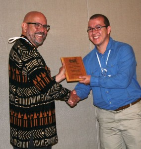

\[caption id="attachment\_1355" align="aligncenter" width="284"\] Ernane Vieira Neto wins ESA's Braun Award (best poster Award at ESA meeting). I had to brag about it because he was too embarrassed to do so himself.\[/caption\]

 

[A great post on why self-promotion, when done right, is good for you and science in general.](http://compassblogs.org/blog/2014/05/30/making-peace-with-self-promotion/)  Jeremy Fox said it well:

> A good, nuanced discussion of an issue near and dear to any blogger's heart. I especially like the point that some level of self-promotion is good not just for you, but for science as a whole ([much as traits like ambition, self-confidence, and a willingness to evaluate the work of others can be good for science as a whole as well as you personally](http://dynamicecology.wordpress.com/2014/02/20/book-review-the-silwood-circle/)).  

H/T:  [Ed Yong](http://phenomena.nationalgeographic.com/blog/not-exactly-rocket-science/) via [Jeremy Fox](http://dynamicecology.wordpress.com/2014/06/20/friday-links-competitive-release-in-academia-and-more/)
