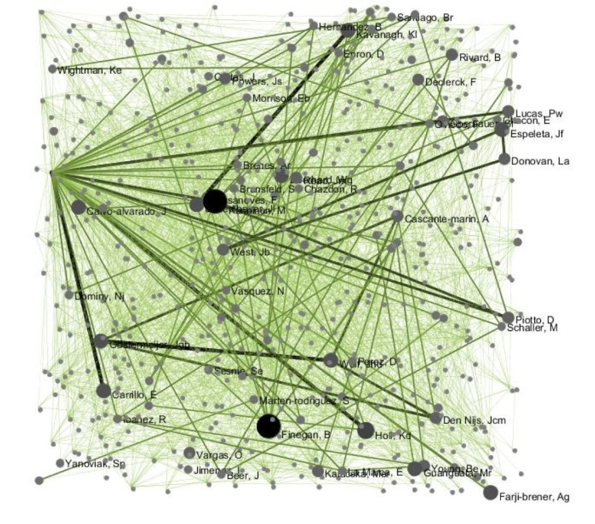

\[caption id="attachment\_1294" align="alignright" width="500"\] Coauthorship network of all articles in 55 ecological journals from 2001-2010 that include at least one coauthor from Costa Rica (Bruna & Hahn, unpubl. data).\[/caption\]

##### A few years ago I called [Stefano Allesina](http://allesinalab.uchicago.edu/) from the University of Chicago to get some insights on a project and we ended up talking about another one of our mutual interests - understanding the factors influencing scientific productivity and impact (my favorite study of his might the analysis of [nepotism among Italian academics](http://www.plosone.org/article/info%3Adoi%2F10.1371%2Fjournal.pone.0021160)). I mentioned that I thought engagement in international collaborations might be particularly important, especially in Latin America, and by the way - why don't I know many Italian ecologists? His response was direct and to the point: "let's find out!". The result was this paper -- a huge undertaking led by his graduate student [Matthew Smith](http://scholar.google.com/citations?user=mVBo9jwAAAAJ&hl=en) and also had as a co-author Stefano's Research Assistant Cody Weinberger -- that was [published today in the open access journal _PLoS ONE_.](http://www.plosone.org/article/info%3Adoi%2F10.1371%2Fjournal.pone.0109195)  It demonstrates international collaboration can influence where your work ends up being published and how much it is cited, but it's not as simple as that...to find out why, read the paper, [blog post on Stefano's page](http://allesinalab.uchicago.edu/), press releases (below), and addendum after the release.

##### Thanks to Matt, Cody, and Stefano - this was a really fun project and I look forward to following up on our results.

##### CITATION: Smith MJ, Weinberger C, Bruna EM, Allesina S (2014) The Scientific Impact of Nations: Journal Placement and Citation Performance. _PLoS ONE_ 9(10): e109195. [doi:10.1371/journal.pone.0109195](http://www.plosone.org/article/info%3Adoi%2F10.1371%2Fjournal.pone.0109195)

**News Coverage:**

- [NPR's Morning Edition](http://www.npr.org/2014/12/15/370878827/why-some-scientific-collaborations-are-more-beneficial-than-others): Joe Palca for his series Joe's Big Idea
- [Science Daily](http://www.sciencedaily.com/releases/2014/10/141008140931.htm?utm_source=feedburner&utm_medium=feed&utm_campaign=Feed%3A+sciencedaily%2Fscience_society+%28Science+%26+Society+News+--+ScienceDaily%29)
- [Herton Escobar/Estado de Sāo Paulo](http://blogs.estadao.com.br/herton-escobar/cientistas-estao-prestando-mais-atencao-em-revistas-de-menor-impacto/)

**Press Releases:**

- [University of Chicago](http://news.ufl.edu/archive/2014/10/analysis-of-125-million-scientific-articles-finds-international-collaboration-can-increase-impact.html)
- [University of Florida](http://news.ufl.edu/archive/2014/10/analysis-of-125-million-scientific-articles-finds-international-collaboration-can-increase-impact.html) [(](http://news.ufl.edu/archive/2014/10/analysis-of-125-million-scientific-articles-finds-international-collaboration-can-increase-impact.html)reproduced Below)

\--- FOR IMMEDIATE RELEASE --

##### **Analysis of 1.25 million scientific articles finds international collaboration can increase impact**

##### Oct. 8, 2014

##### Writer: Cindy Spence, [cindyrspence@ufl.edu](mailto:cindyrspence@ufl.edu), (352) 846-2573

##### Source: Emilio Bruna, [embruna@ufl.edu](mailto:ebruna@ufl.edu), (352) 514-3935 (cell)

##### Skype address: emilio3rd

##### GAINESVILLE, Fla. --- International collaboration tends to boost the profile of the science for all researchers involved, but collaborating with certain countries provides more of a scientific impact than others.

##### For college students aiming someday to become scientists, that means the sooner you start thinking globally, the better.

##### Emilio Bruna , a University of Florida professor of tropical ecology and Latin American studies, teamed up with University of Chicago professor Stefano Allesina and two of his students to study 1.25 million research articles published from 1996 to 2012 in fields ranging from chemistry to psychology. The research will be published online Wednesday in the journal PLOS ONE.

##### Bruna said the team wanted to study the scientific impact of various countries and how collaborations between diverse groups influenced the likelihood of a research article getting published in leading journals or cited by other scientists.

##### “Collaborating with scientists in other countries is really hard work,” Bruna said. “From speaking different languages, to dealing with different cultures, to doing science in different places, to just the bureaucratic stuff like getting research permits and finding the money to work internationally.

##### “There is personal satisfaction, but beyond that, is all this hard work worth it?”

##### The team found that, in most cases, collaboration raises the profile of the science, and the more collaborators, the better, in terms of journal publication and number of citations.

##### For example, Bruna said, collaborations between mathematicians in France and the U.S. tend to end up in higher-profile journals and be cited more than research by scholars from those countries working independently. Similarly, Brazilian and U.S. ecologists who collaborate find their work is cited more frequently than that of scientists from either country working independently.

##### Bruna said there are a few reasons for the positive effect. Each scientist has his or her own social and professional network, so as collaborators increase, so does the number of people who will see and cite the work. While previous researchers had noted this benefit collaboration, however, Bruna and colleagues found that the effect was even more pronounced as the geographic diversity of collaborators increased.

##### Another reason might be access to resources that enhance the quality of research – for instance, many funding agencies and universities have funds available for international collaborations, which would allow researchers to gain access to unique field sites or advanced instruments, And, it stands to reason, he said, that work that involves multiple countries also might be broader in scope and hence have broader implications.

##### “The take-home message for national governments, funding agencies, and universities is that international collaboration can translate into greater scientific visibility, quality and impact,” Bruna said.

##### “We should be reminding our students to think beyond our borders in terms of questions they want to address as scientists. We’re not just better scientists for working internationally,” Bruna said, “we’re better people for it.”

##### \- 30

##### **Additional Comments by Emilio Bruna**

##### Another intriguing finding of our study is that the Global North, although still scientifically dominant, is seeing a drop in citations with the emergence of scientific powers such as China, South Korea and India. In the field of condensed matter physics, for example, the rate of publications and citations for Chinese authors has quintupled in the last 15 years.

##### Although the benefits of collaboration were clear, we were  surprised by some of the more nuanced results. For instance, there was often a paradox between the status of the journals in which scientists were publishing and the number of citations their articles received. Case in point are the Brazilian ecologists, which tend to be publish in lower-tier journals than expected, but their articles get cited more than the others in those journals.

##### What is behind this paradox? Are the authors underestimating the quality of their work? Is the review processed biased agains authors from certain countries? Are incentives to publish in higher-tier journals lacking? Is language an issue? These articles are cited very frequently, so the scientific community obviously thinks they are of high quality.

##### Our analyses also revealed cases in which collaboration failed to boost the research profile. Scientists in some fields already are under-cited, and when U.S. researchers collaborate with them they pay a “citation penalty,” with the work cited less than if they had worked independently. _It’s important to emphasize that we are not saying the science is better or worse, only that we observed this pattern for some combinations of international collaboration and that we need to understand why that is._

#####  Photo: _Biotropica_ Editorial Board at ATBC 2015.
