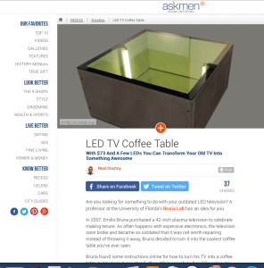
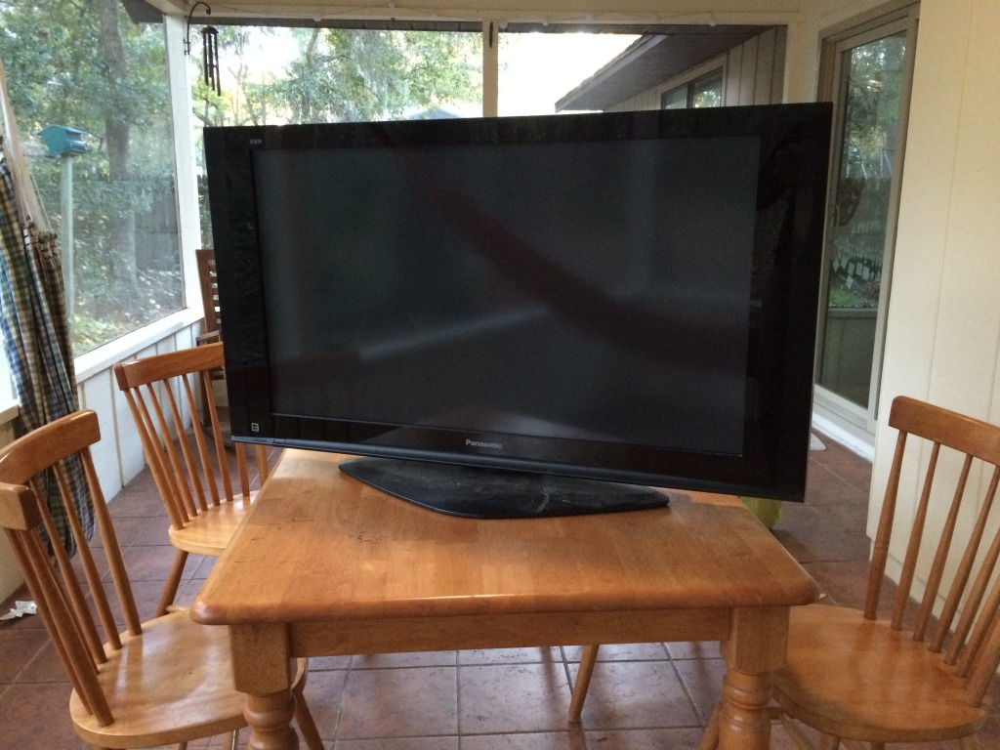
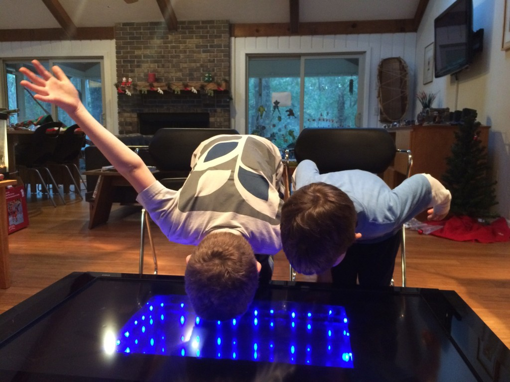

### Update (12/9/14): Wow, I made the "trending" section of [Askmen.com](http://www.askmen.com/) What is that?  Only a website who's mission is "to help guys become Better Men...a movement that has attracted millions upon millions of guys across all ages and backgrounds, and has made \[them\] the world’s No. 1 men’s lifestyle publication."  Whatever. They called this "[the coolest coffee table you've ever seen](http://ca.askmen.com/recess/trending/led-tv-coffee-table.html)".

\[caption id="attachment\_3285" align="aligncenter" width="296"\] Askmen.com\[/caption\]

### The page on [how to repurpose a broken plasma TV into an Infinity Coffee Table](http://brunalab.org/infinity-coffee-table/) has been getting a fair amount of traffic, so I thought I'd provide a [link](http://brunalab.org/infinity-coffee-table/) for those visiting the lab page for other reasons. Enjoy!

42" of Plasma TV awesomeness. You gave our family many, many hours of fun.

 

### 8 hours and $73 later...

 

sooooooooocooooool!!!!

### Want to learn note and see the DIY guide?  Follow [this link](http://brunalab.org/infinity-coffee-table/).
