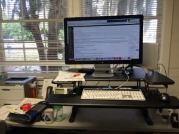

##### _Following the suggestion that if you get asked a question more than twice you should write a blog post about it, here is the info on my standing desk set-up._ 

A few months ago I finally got a standing desk after reading \[see [here](http://www.smithsonianmag.com/science-nature/five-health-benefits-standing-desks-180950259/?no-ist), [here](http://nyti.ms/1uFsBKC), [here](http://lifehacker.com/five-best-standing-desks-1528244287)\] about their benefits for a long time.  Since then several visitors to my office have asked for details on the set-up and where to buy it, so I'm putting this list up in case others are interested. It's based on the research I did in simmer 2015, so if you think there are better options or you want to add to the list just post your suggestions in the comments and I'll incorporate them.  By the way, [you can hack your own for under $25](http://iamnotaprogrammer.com/Ikea-Standing-desk-for-22-dollars.html).

**TL/DR version:** I have a [36" Varidesk Pro Plus](http://www.varidesk.com/varidesk-pro-plus), [Imprint Comfort Mat Nantucket Series Mat](http://amzn.com/B003BYRDK2%20), and [SteelCase chair.](https://www.steelcase.com/products/seating/office-chairs/) Purchased the first two items from Amazon and the chair from [OEC Buisness Interiors](http://www.oec-fl.com/default.asp) in Gainesville. _**\*See Updates Below\***_

**Pros:**

- Best price given my current set-up. I already had a fantastic desk and chair, so I wanted to buy an add-on.
- Ease of set-up: The desk platform arrived ready-to-go, with no installation of building required - just slide it out of the box onto your desk.
- Ease of use: It goes up and down _very_ easily and I use the [app that reminds you to sit /stand](http://www.varidesk.com/desktop-app) at intervals you set (it even provides an estimate of how many calories you have burned at the end of the day)

**Cons:**

- I wish I had more area to scatter papers around my keyboard. The 48" version seems like a solution, but it eats up a ton of counter space.
- I think the monitor riser is about 15 cm too low, but I'm worried about putting it on stand.

\[caption id="attachment\_3575" align="aligncenter" width="400"\] _Emilio's Standing Desk (photo: E. Bruna)_\[/caption\]

##### **Now the details: I narrowed it down to these when thinking about what to choose.**

_**If you can afford a new desk, these are motorized and are fully adjustable**._

- [UPLIFT 900 Sit-Stand Ergonomic Desk](http://www.thehumansolution.com/uplift-900-electric-sit-stand-desk-silver.html)
- [The UpWrite](https://myupdesk.com/upwrite)  (you can even write on it with dry-erase markers)
- [GeekDesk](http://www.geekdesk.com%20)

_**A more economical option is to buy a platform you can add to your current desk:**_

- [Varidesk Pro Plus](http://www.varidesk.com/varidesk-pro-plus)
- [Ergo Kangaroo Pro Junior](http://www.ergodesktop.com/content/kangaroo-pro-junior)

_**It's more comfortable if you have a mat on which to stand; there are [lots of options](http://blog.varidesk.com/the-stand-up-desk-users-best-friend-the-anti-fatigue-mat/) but I bought this one:**_

- [Imprint Comfort Mat Nantucket Series](http://amzn.com/B003BYRDK2%20)

_**You also need a good chair for when you are sitting, and there are some cool options on the market:**_

- [Swopper](http://www.swopper.com/muvman-p/2.htm)
- [Evolution Ball Chair](%20http://www.evolutionchair.com/the_science.htm)
- [Balans Kneeling Chairs](http://www.amazon.com/Variable-Furniture-Balans-Original-Kneeling/dp/B008VL978Q)
- [SteelCase](http://www.steelcase.com/en/products/category/seating/task/pages/office-chairs.aspx): When I started my job at UF the first thing I bought was a very high quality from [OEC Buisness Interiors](http://www.oec-fl.com/default.asp).  It cost >$700 and is worth every penny.

 

**EPILOGUE**

1) [they may not be for everybody](http://lifehacker.com/why-i-killed-my-standing-desk-and-what-i-do-instead-1565554537), and you have to [make sure you use them properly.](http://www.washingtonpost.com/national/health-science/standing-up-at-your-desk-may-energize-you-but-it-also-may-be-tough-on-your-legs/2013/11/22/4d166d9a-0f46-11e3-8cdd-bcdc09410972_story.html)

2) Maybe what you really need is a treadmill desk! [Meghan Duffy tells you what you need to know and her set-up](https://dynamicecology.wordpress.com/2013/01/02/my-treadmill-desk/).

 

**UPDATE 9/29/15:** I still like really like this desk, but have noticed that in the standing position the monitor is about 2 inches too low.  I am looking at some options, of which my first choice is an [adjustable arm like this one by Ergotron](http://www.ergotron.com/ProductsDetails/tabid/65/PRDID/56/language/en-US/Default.aspx) (assuming the platform can tolerate an arm on the end with my heavy thunderbolt display). Another possibility is a table mounted arm, though [this Ergotron seems to be the only one](http://www.ergotron.com/ProductsDetails/tabid/65/PRDID/786/language/en-US/Default.aspx) is strong enough and with enough height. Finally, there are some really cool fixed-height stands (I like this [Uniti by iForte](http://iforte.com/collections/uniti/products/uniti-stand-only#tabs1-dim) and this [HiRise by Twelve South](https://www.twelvesouth.com/product/hirise-for-imac) gets rave reviews), but this means it will be a tad high in the sitting position.

Bottom line - want one that is fully adjustable? You will need to spend some extra money and buy a table by an Uplift. On a budget or the right height? Varidesk is fine.

**UPDATE 1/26/206**  I tried a [Wellness Mat](http://wellnessmats.com/) the other day and they are INSANELY comfortable.  New fave, for sure. Expensive but worth it.
