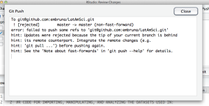

...unless it is made more accessible to the vast majority of us.

I just spent two days trying to figure out why I couldn't push commits from Rstudio to [one of my GitHub repos](https://github.com/embruna). I know RStudio's latest version doesn't play well with GitHub when you try to link to a Repo with HTTPS, so I headed to twitter and as usual The Twitterverse came quickly to my aid:

<blockquote class="twitter-tweet" lang="en"><a href="https://twitter.com/BrunaLab">@BrunaLab</a> <a href="https://twitter.com/github">@github</a> Not from inside RStudio, but "git remote set-url origin NEW-URL" from the shell should do it

— RStudio (@rstudio) <a href="https://twitter.com/rstudio/status/569998356690239488">February 23, 2015</a></blockquote>

Uh oh...I'm already scared since I'm a git amateur and working from the shell, but ok I'm willing to give it a go. And then I got this:

<blockquote class="twitter-tweet" lang="en"><a href="https://twitter.com/BrunaLab">@BrunaLab</a> you can edit .git/config if you can figure out how to open it

— Hadley Wickham (@hadleywickham) <a href="https://twitter.com/hadleywickham/status/569999306163404800">February 23, 2015</a></blockquote>

OK first, of all, Hadley Wickham is helping me on twitter! But once I got past that, "...if you can figure out how to open it" isn't exactly inspiring. So after I tried and failed to fix from the shell I decided to cheat, delete the RStudio Project, and start over with a new one linked via SSH. Do some coding, save, Commit, Push, and....   No luck.   Back to twitter:

<blockquote class="twitter-tweet" lang="en"><a href="https://twitter.com/BrunaLab">@BrunaLab</a> possibly something wrong with your credentials then. What’s the error message?

— Karthik Ram (@_inundata) <a href="https://twitter.com/_inundata/status/570086637876568064">February 24, 2015</a></blockquote>

And Karthik was right.  I found this [helpful post on this](https://github.com/OHI-Science/ohicore/issues/104) by [Ben Best](https://github.com/bbest) that told me what I needed to do, but I couldn't even do the basic test drive from the shell that would tell me if it was indeed my problem. Plus I also started getting another message:

...for which Karthik provided a detailed, above-the-call of duty explanation and solution via email.  I tried that for a while, _think_ I correctly implemented the fix and then...no luck.  The authentication problem again (I think).

**It's been two days. It's 1 am. Fuck it.**

I deleted the R studio project, reinstalled git, and followed the [great instructions on the BurnedPixel Blog](http://burnedpixel.com/blog/setting-up-git-and-github-on-your-mac/) to set up everything from scratch. Created a new RStudio project, linked via SSH, Pull, Edit, Commit, Push and:

Yes!!!

My point?  I was stupid for dedicating as much time and effort to this as I did...**I should have just folded and moved on - trying to figure this out cost me valuable research time, to say nothing of the fact I ignored the other million things I had on my plate.** Of course, I realize that 1) had I had some formal training in Git I probably could have solved it in 10 minutes, 2) If Karthik were next door it could have been solved in 10 minutes, 3) maybe the use of a Git GUI would have helped.

All of those are true, but I would bet that most graduate students still don't get training in this stuff, and those of us who are comfortable with programming but not in the Premier League...well, I think this kind of frustration and time loss and not distrust of getting scooped or philosophical divergence about the importance of Open Science are the reason why most people don't commit to using version control as part of their daily routine for their programming.  It's because the learning curve is too steep.

I was willing to stick with it for days, but most ecologists won’t, and shouldn't -- the effort is better placed elsewhere. **There HAS to be a simpler way or this will never become mainstream in our field.** 

Rant over.

P.S. Is there a good Git GUI out there?

Edit 10:23 am: Suggestions already rolling in.

<blockquote class="twitter-tweet" lang="en">
<a href="https://twitter.com/BrunaLab">@BrunaLab</a> great post! setup is harder than usage (yikes!) highly recommend sourcetree as a git gui <a href="http://t.co/jZvLhkBDqs">http://t.co/jZvLhkBDqs</a> <a href="https://twitter.com/hormiga">@hormiga</a>
— Jennifer Bryan (@JennyBryan) <a href="https://twitter.com/JennyBryan/status/570604291100168192">February 25, 2015</a></blockquote>

