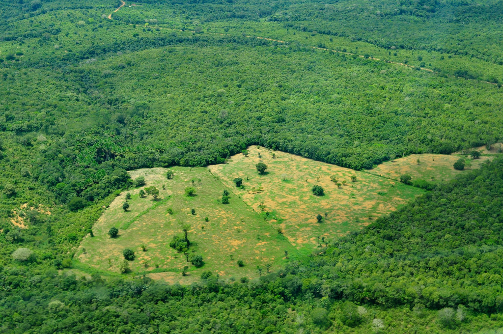

 

Last night this came across my twitter feed:

<blockquote class="twitter-tweet" lang="en">
Stay engaged—The Brazilian Amazon region had shrunk to just 18% of its size. <a href="http://t.co/4y6V75adit">http://t.co/4y6V75adit</a> by <a href="https://twitter.com/lucysiegle">@lucysiegle</a> <a href="http://t.co/VE4EZ5ErTM">pic.twitter.com/VE4EZ5ErTM</a>
— Brazil Character Lab (@scharlab) <a href="https://twitter.com/scharlab/status/630513885200687104">August 9, 2015</a></blockquote>

I nearly fell over when I saw that, so I clicked the link and landed on a [column in The Guardian\*](http://www.theguardian.com/environment/2015/aug/09/has-the-amazon-rainforest-been-saved?CMP=twt_gu) (UK) by [Lucy Siegel](http://www.theguardian.com/profile/lucysiegle) in which I was  surprised to read this (emphasis mine):

> Peak deforestation angst didn’t actually coincide with peak deforestation. While the wearing of “Save the Rainforest” T-shirts was de rigueur in the late 80s, the worst destruction came in 2004, a year when we (as in humankind) chopped down 27,000km2 of Amazon rainforest. **By that point there wasn’t much left to play with:** **the Brazilian Amazon region** **(the largest continuous tropical rainforest in the world) had shrunk from four million kilometres (close to half the size of continental Europe) to just 18% of that size.**

The message of the column is to "stay engaged" to fight further deforestation, which is laudable. But before you get depressed and lose interest because of how little of the Amazon is left, I just wanted to point out that the 60% of the "Amazon Rainforest" inside of Brazil's borders has been shrunk to about  [~82% of it's 1980's size](https://en.wikipedia.org/wiki/Deforestation_in_Brazil), not 18%. The author (and apparently her Editor and fact-checkers) confused "percent cleared" and "percent remaining".

**Having said that, please do stay engaged!**  The 18% loss from ranching, dam creation, etc., is tremendous and has had some [catastrophic impacts](http://www.mongabay.com/brazil.html).

 

H/T to [@scharlab](https://twitter.com/scharlab) for the link to the original post; I highly recommend following @scharlab to get a never-ending stream of excellent Brazil-related journalism.

 

\[caption id="attachment\_6923" align="aligncenter" width="770"\] Aerial view of the Amazon rainforest, near Manaus the capital of the Brazilian state of Amazonas. Brazil. P[hoto by Neil Palmer/CIAT for Center for International Forestry Research-CIFOR.  (CC BY-NC-ND 2.0).](https://www.flickr.com/photos/cifor/5660258677/in/photolist-9CbiGR-emJuJf-ze94d-cNL4cb-beXhk4-9CdYF5-tNcTSP-7PDggL-azsp9w-fMU3Dj-5f1c5X-9Cbg2Z-9Ce9sA-v7gpNC-gTmX9g-9CeeuC-9CdS1m-8Qvdwj-e7EcGm-7dWJSX-9CbbKi-4DDBts-4MSVuL-bpoc9k-9g5Vbg-7Yjzct-tbMnvt-njtzi5-3MT4bP-vP3xkW-eBrjfb-azqkdR-9ZzCxK-azsWrY-2L3KsB-9Cb5Av-9Cb1bH-ozMWEm-7aCxyb-4uayoQ-6n19va-4BcbXA-rM16bJ-3Y7tpu-7frjkm-nNYe5x-qTpDP-deS6P5-bpoSHc-8s5jJY)\[/caption\]
