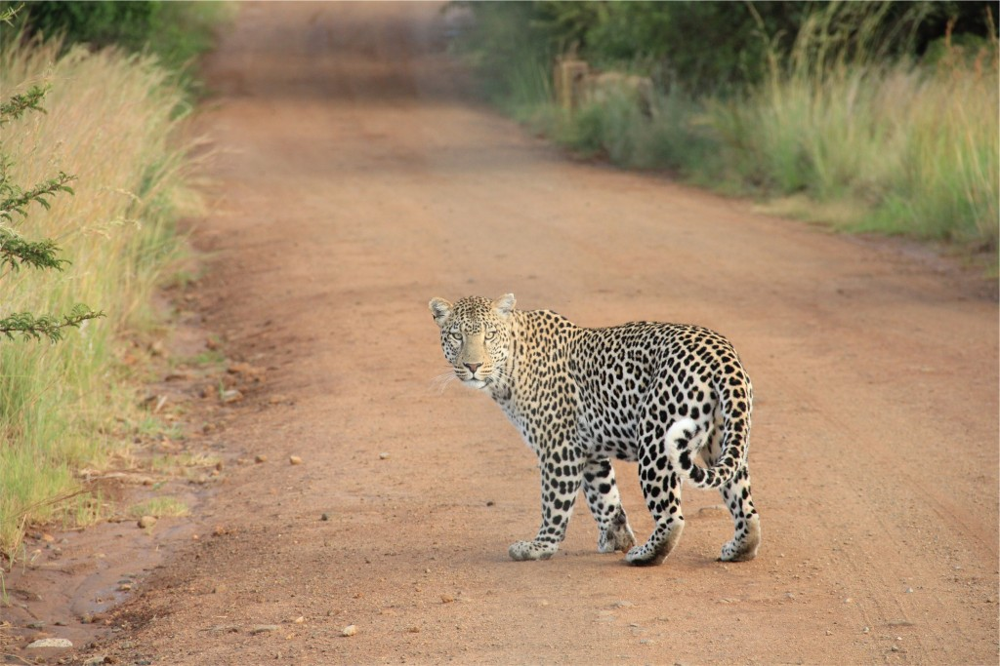

Faculty Position in Large Mammal Ecology/International Conservation at the [University of Florida](http://www.ufl.edu/)

This position is a 12-month tenure-accruing appointment (Assistant Professor) available in the [Department of Wildlife Ecology and Conservation (WEC)](http://www.wec.ufl.edu/) at the University of Florida (40% teaching, 60% research appointment).  The successful candidate will: (1) develop an international research program that investigates topics such as factors that drive distribution and dynamics of large mammal populations at the landscape scale, human-wildlife conflict, and/or sustainable harvest management strategies for large mammals; (2) teach one undergraduate and one graduate course/year, including a core course in the undergraduate curriculum and a graduate course that might focus on ecology and conservation of large mammals, international wildlife policy, quantitative approaches for research on large mammals, or other topics related to large mammals in the area of expertise of the candidate; and (3) develop an international experiential component for the teaching program for undergraduate or graduate students.  The research and graduate training program of the successful candidate will focus on wildlife conservation in developing countries, as well as address issues with large mammals in Florida.  The faculty member will play a leadership role in linking WEC’s programs with international conservation and funding organizations, international programs across UF’s campus, and programs that manage and conserve large mammals in Florida.  Qualifications: Candidates must possess a doctorate or foreign equivalent in wildlife biology, ecological or biological sciences, or related natural resources discipline; evidence of scholarship and in-depth knowledge of wildlife ecology and conservation; experience with research and conservation of large mammals in developing countries; willingness to work with resource agencies, NGOs, and stakeholders; and commitment to teach and inspire undergraduate and graduate students.  Postdoctoral experience and experience with international NGOs are desirable. Review of applications will begin 1 November. For more information contact Search and Screen Committee Chair Lyn Branch (BranchL@UFL.EDU), or for information and to apply, go to to http://explore.jobs.ufl.edu/cw/en-us/job/493151.  The University of Florida is an Equal Opportunity Institution dedicated to building a broadly diverse and inclusive faculty and staff.

\[caption id="attachment\_7278" align="aligncenter" width="770"\] Jaguar ambling along a road...you know, just chillin'.  \[/caption\]
