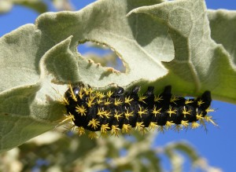
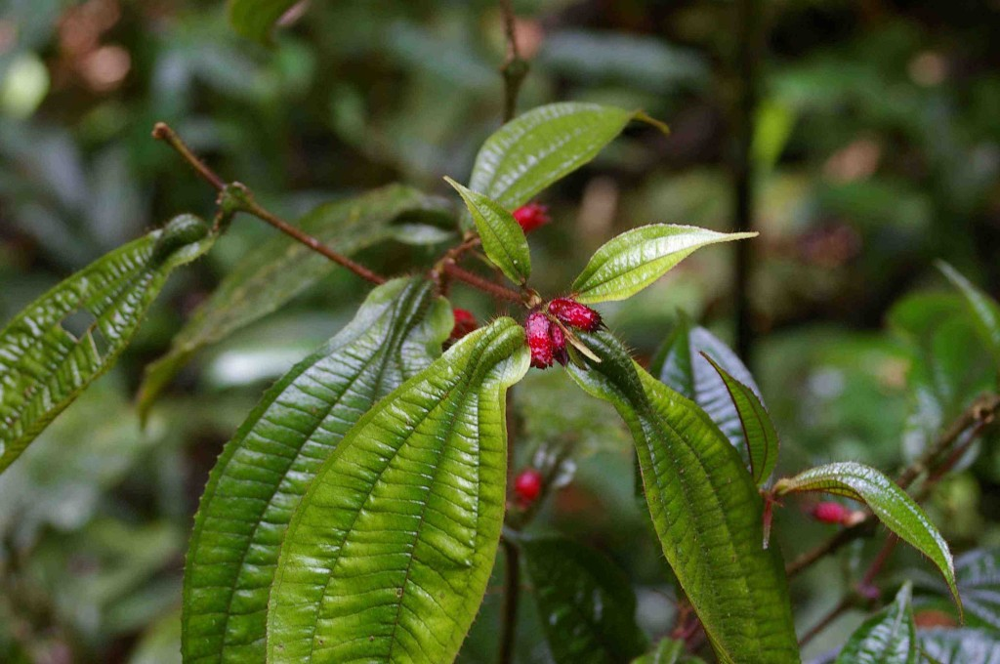

Our lab members' interests range from trying to understand the consequences of deforestation in the Amazon for plants to how international collaboration influences the impact of research papers.  Below are some of what we consider our major accomplishments in four areas of research, with links description of the results pdf's of the articles.

it's a work in progress, with more to come (h/t to [Ed Yong](https://twitter.com/edyong209/status/501681160494534656) for [the suggestion](https://twitter.com/edyong209/status/501681160494534656)).

**The effects of deforestation in the Amazon on plant populations**

_Heliconia acuminata_ is pollinated by _Phaethornis_ hummingbirds (Photo by E. Bruna)

- There may be fewer seedlings in forest fragments than primary forest because seed germination in fragments is much lower there \[[Part 1](http://www.wec.ufl.edu/faculty/brunae/Publications/Bruna_1999_Nature.pdf), [Part 2](http://www.wec.ufl.edu/faculty/brunae/Publications/Bruna_2002_Oecologia.pdf), [Part 3](http://www.wec.ufl.edu/faculty/brunae/Publications/Uriarte_etal_2010_Ecology.pdf)\], probably due to the fact that forest fragments are much, much hotter and drier. (By the way, we're studying similar issues in the Atlantic Forests of Brazil \[[Part 1](http://brunalab.org/wp-content/uploads/2013/11/Jurinitz_etal_2013_Biotropica.pdf)\]),
- [Plants in forest fragments can grow much more slowly](http://www.wec.ufl.edu/faculty/brunae/Publications/Bruna_et_al_2002_JOE.pdf) (or even shrink) when compared to those in primary forest, and [chronically reduced growth can add up over time](http://brunalab.org/wp-content/uploads/2013/01/Gagnon_etal_2011BiolCons.pdf) to have some pretty major effects on plants.
- However, the way in which these factors interact to influence long-term population viability is complicated, and different mechanisms (e.g. reduced growth, reduced recruitments) may be more important in fragments small fragments than larger ones. \[[Part 1](http://www.wec.ufl.edu/faculty/brunae/Publications/Bruna_2003_Ecology.pdf), [Part 2](http://www.wec.ufl.edu/faculty/brunae/Publications/Bruna&Oli_2005_Ecology.pdf)\].
- Ultimately, it may come down to seed dispersal and the way in which different birds transport seeds around these deforested landscapes \[[Part 1](http://www.wec.ufl.edu/faculty/brunae/Publications/Uriarte_etal_2011_Ecology.pdf), [Press Release](http://news.ufl.edu/2011/05/18/seeds/)\]. Ironically, the [low population density in forest fragments](http://wp.me/a32RIy-o6) may actually [_enhance_ gene flow in and out for forest patches](http://brunalab.org/wp-content/uploads/2013/11/Cortes_etal_2013_MolEco.pdf).

**Herbivory, Seed Predation, plant demography, and the Conservation of Brazil's Cerrado**

Caterpillar eating one of the species studied by our lab - the Cerrado's famous _Solanum lycocarpum_, whose fruits are dispersed by Maned Wolves (_Chrysocyon brachyurus_). (Photo by F. Mundim).

- Leaf-cutter ants are recognized as the dominant herbivore in lowland tropical forests (i.e., "rain forests"), but [they are actually far more abundant in the savanna woodlands known as _The Cerrado_, and they also consume about six times the amount of plant materials as Atta in rain forests do](http://www.wec.ufl.edu/faculty/brunae/Publications/Costa_etal_2008.pdf).   Although comparisons with other savanna systems are complicated, the proportion of plant biomass consumed by _Atta in_ the _Cerrado_ is about 25% of that consumed by the entire ungulate community in some African savannas and greater than or comparable to the total herbivory observed in some other terrestrial ecosystems.
- This huge amount of herbivory caught people by surprise because it was thought that herbivory was negligible in the cerrado - this biome doesn't have the antelope, zebras, and other large mammalian herbivores that African savannas do.  However, it does have lots of ants, and in addition to being [herbivores that have huge effects on plant survivorship and reproduction](http://www.wec.ufl.edu/faculty/brunae/Publications/Mundim_etal_2102_Oecologia.pdf), _Atta_ and other ants are [voracious consumers of seeds](http://www.wec.ufl.edu/faculty/brunae/Publications/VazFerreira_etal_2011_Oikos.pdf), which we showed can [significantly reduce seedling establishment](http://www.wec.ufl.edu/faculty/brunae/Publications/VazFerreira_etal_2011_Oikos.pdf) for some species.
- Why are _Atta_ so much more abundance in the _Cerrado_? In part it may be because roads are proliferating in the _Cerrado_ due to agricultural expansion, and [_Atta_ queens preferentially colonize on and along roads](http://www.wec.ufl.edu/faculty/brunae/Publications/Vasconcelos_etal_2006_Biotropica.pdf).

**Mutualisms between Amazonian ants and plants**

_Maieta guianensis_, an Amazonian myrmecophyte studied by the Bruna Lab & Collaborators (Photo: B. Inouye).

- Sometimes your biggest accomplishment is being one of the first to demonstrate the obvious. Many tropical plants in the tropical rain forests have special structures in which specialized ant species establish colonies, and in return defend the plant agains herbivores (these plants are known as 'myrmecophytes' or 'ant-plants'. Although it was known that myrmecophytes could host different species of ants, it was generally assumed that the ants provided similar services to their host plants. We showed [this is definitely _not_ the case](http://www.wec.ufl.edu/faculty/brunae/Publications/Bruna_et_al_2004_Oecologia.pdf).
- It turns out workers of some ant species residing in plants don't recognize the chemical volatiles emitted by plants when they are attacked \[[Part 1](http://www.wec.ufl.edu/faculty/brunae/Publications/Lapola_et_al_2003_Biotropica.pdf), [Part 2](http://www.wec.ufl.edu/faculty/brunae/Publications/Bruna_et_al_2004_Oecologia.pdf), [Part 3](http://wp.me/a32RIy-8X)\], so they don't rush out to defend the plant. Or maybe they recognize them, but just ignore them...we're not sure about that).
- Ultimately, [these differences can lead to reduced population growth rates](https://peerj.com/preprints/368/) if you lose the 'good' parter and it is replaced by the 'poor' partner, even if you only have the poorer partner for a short time period.

**SCIENCE: how we do it, where we do it, and why some countries or individuals are more productive than others**

[![Participants in the 1962 Neotropical Botany Conference held at St. Augustine, Trinidad & Tobago. It was at this conference that the Association for Tropical Biology (now Association for Tropical Biology & Conservation, ATBC) was founded.  Bottom photo: Members of the ATBC Executive Committee at the 2014 in Cairns, Australia.  These photos highlight the demographic shift in the ATBC's membership, which is also reflected in how the proportion of women on the Editorial Board of its journal Biotropica has changed over time.  To see how the representation of women on editorial boards of 10 journals in environmental biology changed from 1985-2013, see Cho et al. ](images/Cho_etal_ATBC_horizontal-1024x283.jpg)](http://brunalab.org/wp-content/uploads/2014/08/Cho_etal_ATBC_horizontal.jpg)

Participants in the 1962 Neotropical Botany Conference held at St. Augustine, Trinidad & Tobago. It was at this conference that the Association for Tropical Biology (now Association for Tropical Biology & Conservation, ATBC) was founded. Bottom photo: Members of the ATBC Executive Committee at the 2014 in Cairns, Australia. These photos highlight the demographic shift in the ATBC's membership, which is also reflected in how the proportion of women on the Editorial Board of its journal Biotropica has changed over time. To see how the representation of women on editorial boards of 10 journals in environmental biology changed from 1985-2013, see Cho et al.

- [Ecologists studying the tropics know a _lot_ about a very limited number of places](http://wp.me/a32RIy-8t).  This is true both globally and regionally \[e.g., the [Amazon/Andes](http://wp.me/a32RIy-8m)\].
- Even though it's been over 25 years since the scientific community became aware of different types of gender disparities in STEM, [women remain underrepresented on the editorial boards of many journals](https://peerj.com/preprints/369/) in environmental biology.
- The country in which your co-authors are based can influence both where you publish and how much you are cited \[link coming soon\].
