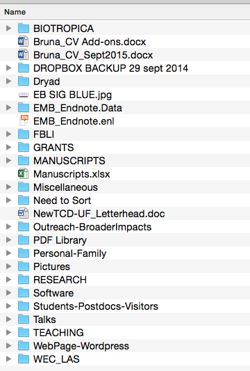

\[caption id="attachment\_7614" align="aligncenter" width="300"\] George Carlin: "A house is just a pile of stuff with a cover on it." (photo: [Sarah Gerke](https://www.flickr.com/photos/sublimelyhappy/1087050219/in/photolist-4YuHZ3-ek8bA5-bVSfHu-c3pBWh-7YLvnG-81jj4a-81nue7-2E4qaa-yPdYT-d9fJRq-bnQWU4-6VtKpC-dWBM2z-pw6NRy-sD6oq-61EkZL-exUsw7-4Y3JJT-8AZQvz-nGmUUR-aKWRpM-4vhWR8-dXTYHx-agxoua-4Y9rhT-9RLoqJ-yhhqDF-4ixq6P-gZFYdA-6qkSfM-9gKdUq-4XZhLn-2nAVQ1-5nygCH-7Gd8PN-7b4jEh-5hC9wH-aecP52-7xtQbA-6rGSfL-beWzDK-dnSDT-8Uqxdv-D4BFM-6BGyWW-7F5VhH-ebvEAA-azncSk-5NJ597-7pjbtQ) CC BY NC ND 2.0).\[/caption\]

 

 

I've been trying to find a way to store my files so that I can access them at work, from home, and while traveling (TLDR: I use a departmental server. This is nice because it is backed up nightly, but trying to download or open files using a VPN connection can be incredibly slow).  One promising solution was our university giving all faculty, staff, and students 1 Tb of storage using Microsoft OneDrive, but....[nope, that didn't work out](http://brunalab.org/blog/2015/07/24/onedrive-notes/).  And it turns out we are not allowed to use DropBox for official university business.

But let's say for the sake of argument say that I was. If you wanted to sync your files with Dropbox you would have to

1. sync the server and dropbox, which likely means Firewall issues and linking a university server to a service explicitly not allowed by the university.
2. Transferring all files to a portable hard drive or computer, then setting up a sync with Dropbox from one of these.

Either way, let's say you did this. And then lets say you checked out some of your folders on dropbox and foudn they were empty. And then say you spent a few days trying to figure this out, and [finally found this](https://www.dropbox.com/help/145) on the Dropbox Help Center:

 

> Windows only allows file and folder names of [260 characters or less](http://msdn.microsoft.com/en-us/library/aa365247(v=vs.85).aspx). On top of this limit, certain applications—such as Microsoft Excel—have shorter limits ([218 characters](http://support.microsoft.com/kb/325573)). Note that Windows counts the file path as part of the name, so the sample file path below would be 142 characters, not 16:
> 
> `C:\Users\Panda\My Documents\Dropbox\Creative Nonfiction\My Autobiography\Favorite Things\Favorite Foods\Bamboo\Family Recipes\**Fresh Leaves.doc**`

 

My guess is that most of us have lots of nested folders in our attempts to organize our work lives. That measn that even though my folder on the server looks preety simple when I open it...

 

\[caption id="attachment\_7613" align="aligncenter" width="360"\] Please don't ask about "Need to Sort"\[/caption\]

 

...one of the files I was using today had 176 character in the file name and was 12 folders deep (from university server to the folder where the manuscript was stored. **Take home message: Dropbox and other cloud storage systems that sync with your hard drive may not actually be saving them because of how organized you are!**

 

So I was wondering...how do you organize your life? Lots of subfolders?  Everything stored together?  An archive of folders and files no longer needed (published papers, old talks) and a smaller one of things you are currently working on?  Long descriptive file names? Short ones?  And has this storage system influenced how you do your backups and long-term archiving? Is all that organization actually inefficient?
