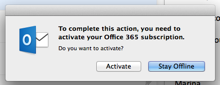
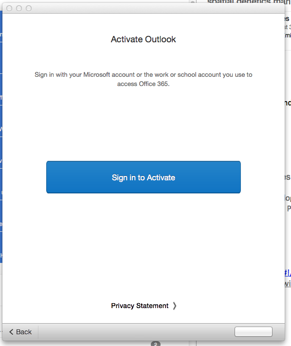
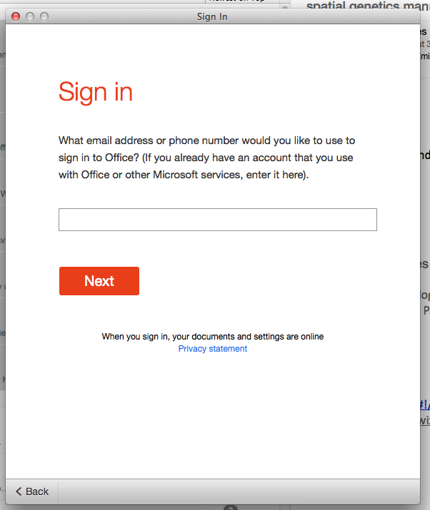
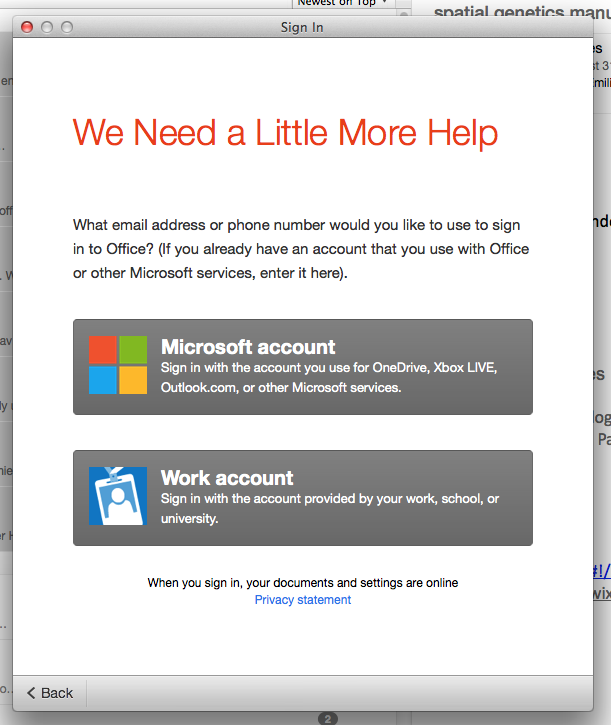
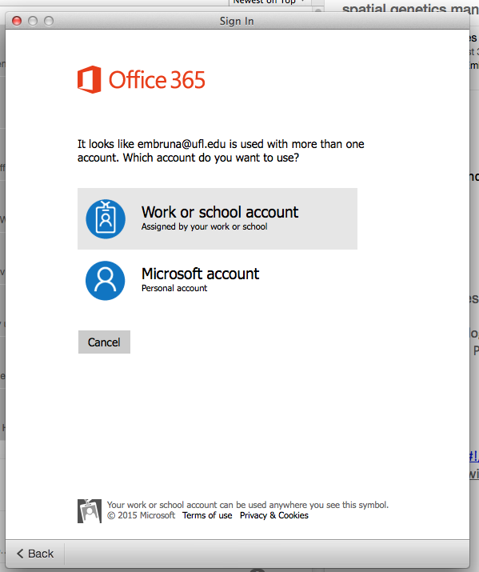
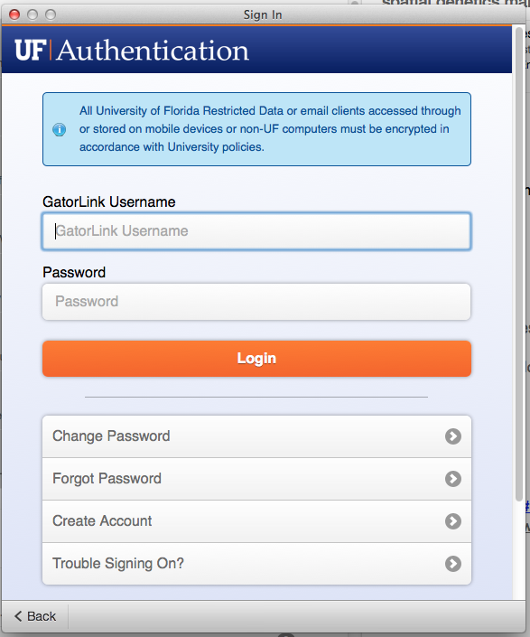
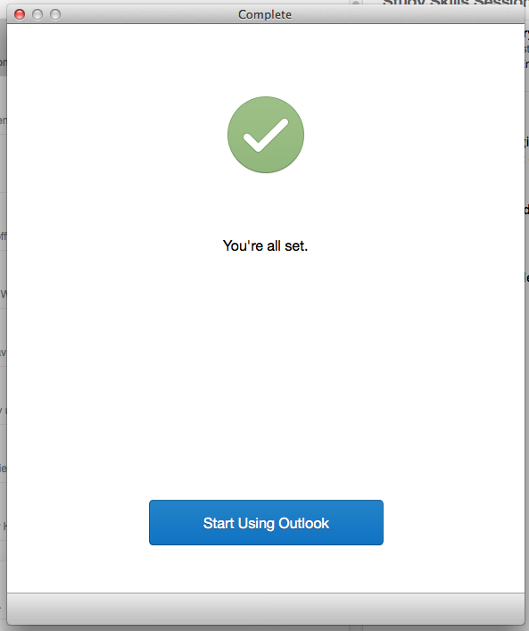

**Step 1:** Fire up Outlook.

**Step 2:** Click "send and receive" and wait for this pop-up window:

 

\[caption id="attachment\_7396" align="aligncenter" width="441"\] step 3\[/caption\]

**Step 3:** Click "Activate" and wait for the following window, which asks you exactly the same thing as the window above.

 

\[caption id="attachment\_7395" align="aligncenter" width="598"\] step 4: click to activate...again.\[/caption\]

 

**Step 4:** Cick the blue button to activate, at which time the following window appears:

\[caption id="attachment\_7394" align="aligncenter" width="602"\] steps 5-6\[/caption\]

 

**Step 5:** enter my email address.

**Step 6:** Click "Next". Now this window will appear, asking me if I am using a Microsoft email account or an email account from work.

\[caption id="attachment\_7393" align="aligncenter" width="611"\] step 7\[/caption\]

 

**Step 7:** Click "Work account". Since the original audience for this email client was apparently either 5 year old kids or people who did a lot of email while drunk, the following window asking me **exactly the same thing** now appears:

\[caption id="attachment\_7392" align="aligncenter" width="599"\] step 8\[/caption\]

 

**Steps 8:** Click "Work or School Account". Now a university authentication window appears in which I must...

**Steps 9-10:** ...enter my username and password.  This stem is 8 keystrokes more efficient than expected because I am not required to type "@ufl.edu".

\[caption id="attachment\_7391" align="aligncenter" width="587"\] step 9-10\[/caption\]

 

**Step 11.**  Almost there! But because you may not yet have carpel tunnel syndrome, or because you may have fallen asleep, or just to make sure you haven't tried to drown yourself in the three inches of coffee still burning in the carafe after yesterday's lab meeting, you are asked to click one last button.

\[caption id="attachment\_7390" align="aligncenter" width="593"\] step 11\[/caption\]

 

 

 

\[caption id="attachment\_7398" align="aligncenter" width="770"\] [Photo by Scott Butner](https://www.flickr.com/photos/rs_butner/5338041185/in/photolist-8tby6E-nrQtTJ-ejscZ3-ejscYb-ejsd2G-7Yx3YG-9Zdanv-dRK8jv-dRK7ta-dRQGaN-8Ej6BA-csMq97-hURp-azyUxx-22GmV-e7G7rT-6sCntk-FF7hX-FF7kF-dkDib9-asPvcf-FF5YS-2Yq8d-bRkBA-4hY5Bb-8Y3YGY-wjSSS-76kpFo-dTQpY4-cV33Fj-dpsHiL-98GRER-3aSjuB-8cx4qH-fsFydd-Yaqtz-76krRA-na9jmq-b3Yzo-8cx4qr-76kqjA-5JKGs-9FuU6J-na4pZ9-na78DY-na7ewj-8KktZX-jxtqH-PZG4i-omyps) (CC BY-NC-ND 2.0). It depicts the blissful state of a UF faculty member that has successfully checked their email in the morning with Microsoft Outlook 15.6 for Mac.\[/caption\]

 

 

**UPDATE 9/29/15:** Updated to Yosemite. Installed Office for Mac 2016. Problem solved.
