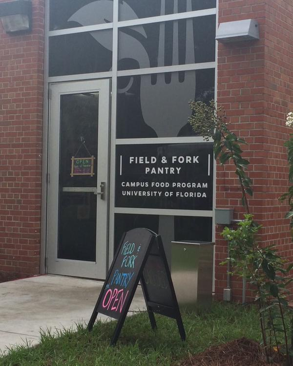

> ["One in 10 University of Florida students reports going hungry at times. Among students from low-income families, the hunger rate is twice that."](http://news.ifas.ufl.edu/2015/05/uf-food-bank-breaks-ground-today/)
> 
> Jack Payne, Vice President of UF's Institute of Food and Agricultural Sciences

Yeah, I was shocked when I heard that too.  But in great example of a University doing something about a problem affecting it's students, [UF's Institute of Food and Agricultural Sciences created a Food Pantry](http://www.gainesville.com/article/20150901/ARTICLES/150909973) to help students in need get the food they need so they can concentrate on school.  It's a really great initiative, and one that I think represents what makes [Land-grant institutions](https://en.wikipedia.org/wiki/Land-grant_university) so special.

This weekend I was sorting some clothes our kids had outgrown for donation to Goodwill and I realized that many of our students are full-time parents as well as students. This is not only emotionally challenging (and exhausting), it is financially challenging as well. Not only do they have to pay for tuition, books, supplies, and all the other typical expenses, they also go the added burden of child care, clothes, toys, rockers, books, diapers, breast pump, bottles, formula...it adds up. This may be especially true for our international graduate students - far from home, without the help of family, trying to stretch a graduate student stipend as far as they can, and for whom visa restrictions may make it impossible for their partners to work.

So I was wondering...why not start a UF Kids Bank?  I would rather donate our clothes, toys, books, and other baby paraphernalia to UF graduate students and undergraduates who need it than to Goodwill or the Salvation Army, and I'm sure I'm not alone.

Who's in and who could help? [The Dean of Students](https://www.dso.ufl.edu/)? [Family Youth and Community Sciences Extension](http://fycs.ifas.ufl.edu/)? [Master's in Sustainable Development Practice](http://mdp.africa.ufl.edu/)? Or am I just going to run this put of my lab?

\[caption id="attachment\_7767" align="aligncenter" width="600"\] The UF Food Pantry (photo: Emilio Bruna)\[/caption\]
