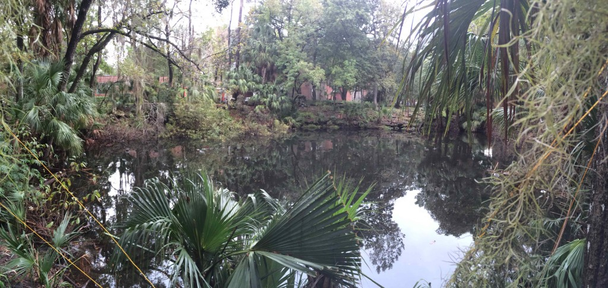
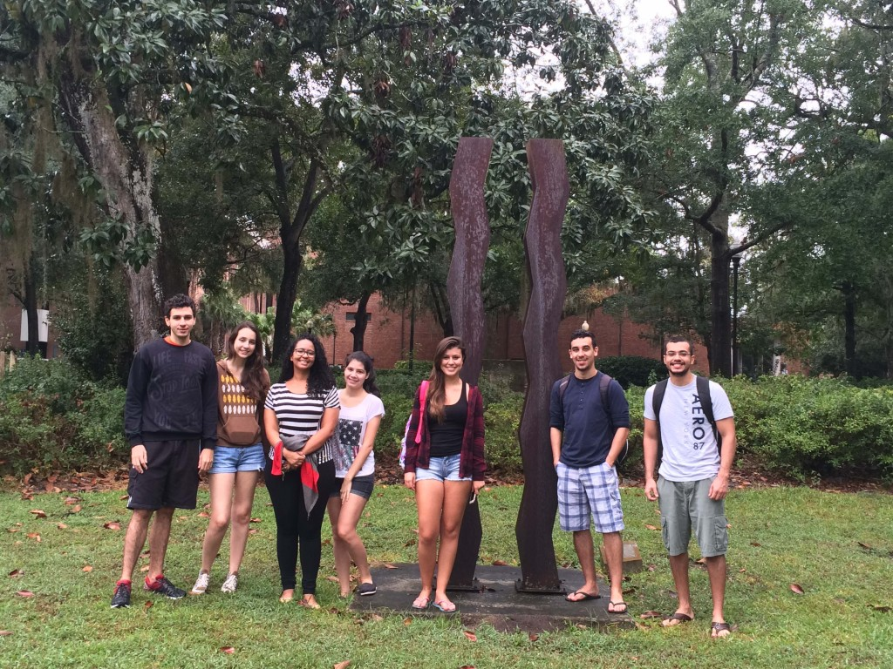
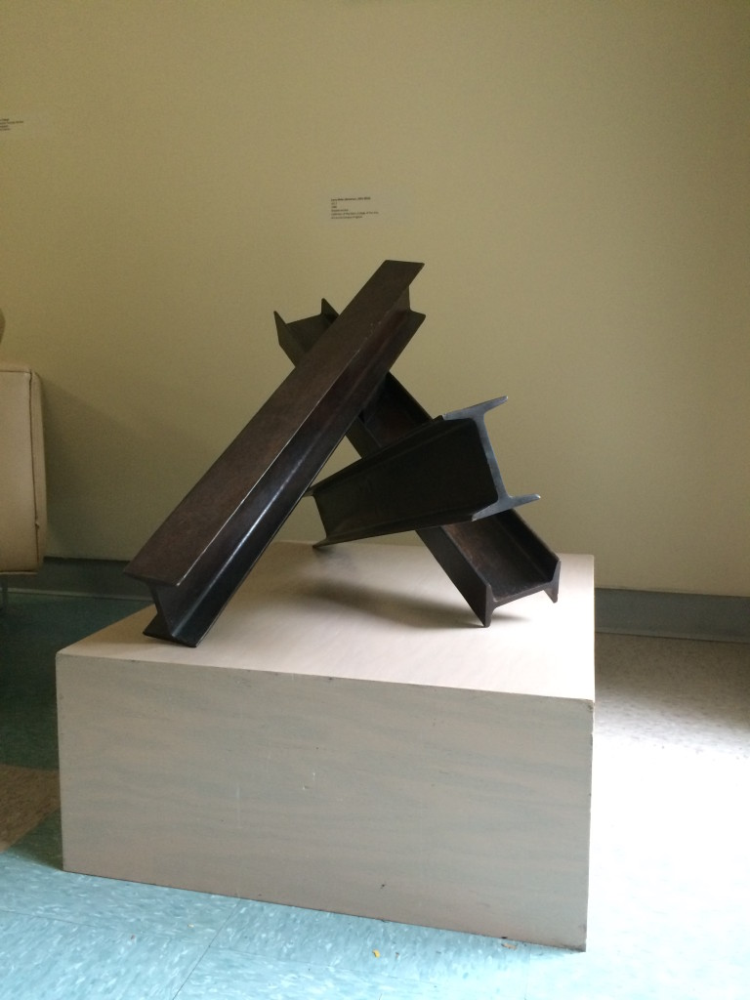
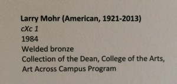
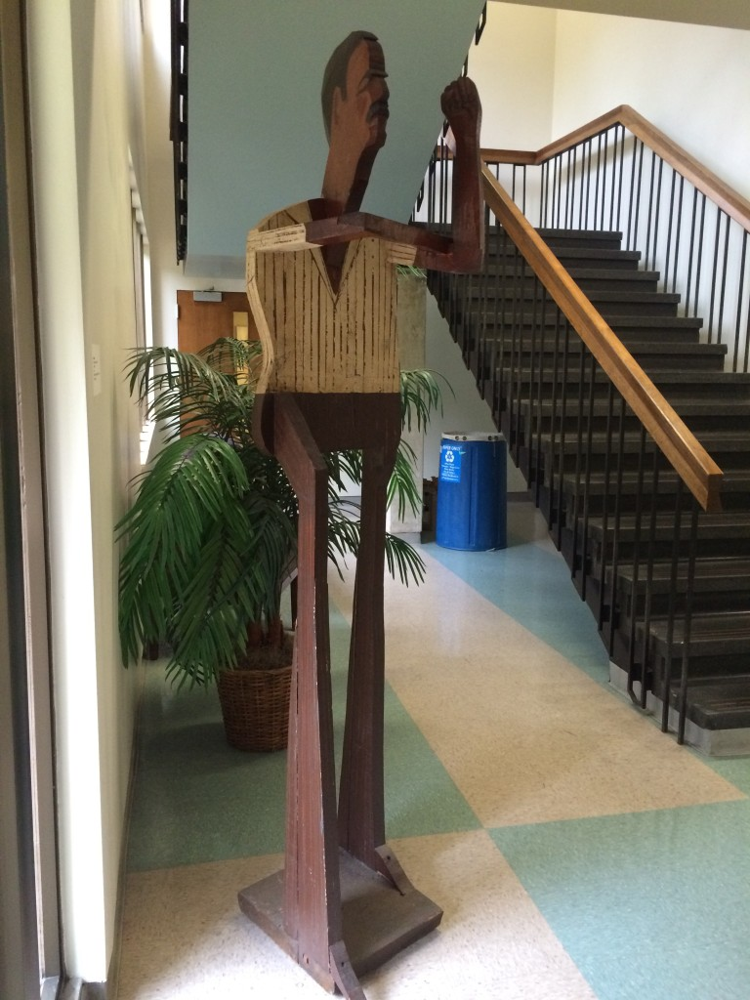
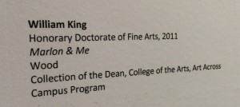
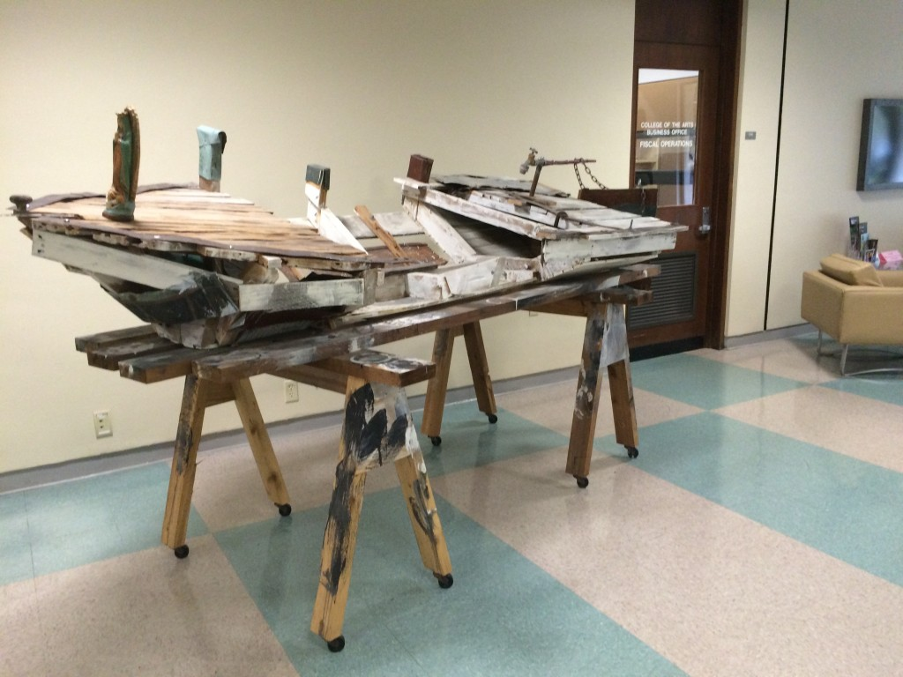
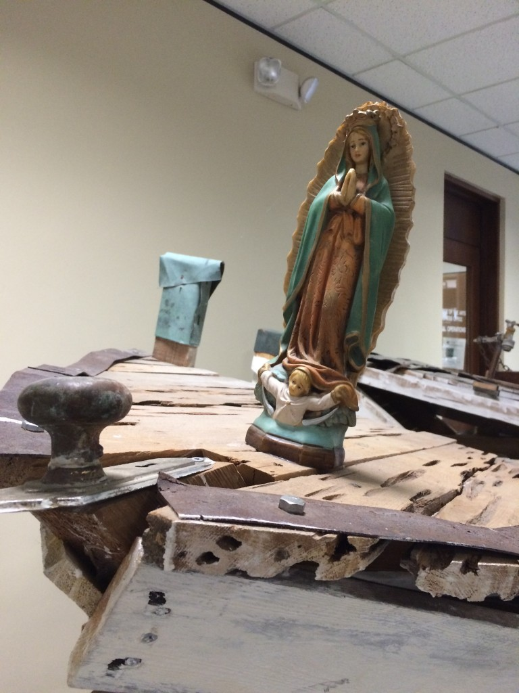
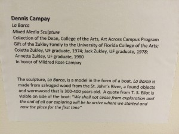

I've been feeling a little cynical about universities these last few days, including my own. [Politicians frequently use universities and their faculty as punching bags](http://politics.heraldtribune.com/2011/10/10/rick-scott-wants-to-shift-university-funding-away-from-some-majors/), accusing us of being a [training ground for leftists radicals](http://articles.sun-sentinel.com/2013-06-01/news/fl-bocol-oped0601-20130601_1_college-teachers-boston-university-alexa-foundation) and saying ignorant things about the 'value' the [social sciences](http://www.slate.com/articles/double_x/doublex/2015/10/jeb_bush_says_psych_majors_end_up_working_at_chick_fil_a.html) and [humanities](https://www.insidehighered.com/news/2014/01/31/obama-becomes-latest-politician-criticize-liberal-arts-discipline). If your people aren't already allowed to carry guns on your campus, [they may be soon](http://www.miamiherald.com/news/politics-government/state-politics/article40508166.html). And I haven't even mentioned the depressing state of funding for the sciences (here are the [numbers for my discipline](https://nsfdeb.wordpress.com/tag/funding-rate/)) or the way in which scientists working on tropics like climate change or GMOs are harassed by [members of the government](http://www.vox.com/2015/10/26/9616370/science-committee-worse-benghazi-committee) or [organizations](http://www.gainesville.com/article/20150821/ARTICLES/150829940) who don't like the results of their research. [Plus it would be nice to get a raise once in while](http://www.gainesville.com/article/20151118/ARTICLES/151119614/1182?Title=UF-faculty-union-administration-still-at-impasse-on-pay).  Can you blame me/us for feeling a bit blue?

So when I walked into class this morning and saw how tired my students looked - they've been studying for finals and working on projects - I decided to improvise, get us outside, and find some way of refreshing our batteries. But what to do?

And then I remembered...our classroom is in Grinter Hall, which is the home of the [Center For Latin American Studies](http://www.latam.ufl.edu/). I have an office in Grinter, sometimes go when I need a few minutes to think I walk less than sixty seconds to this oasis by the [College of Design Construction & Planning](https://dcp.ufl.edu/) where I can be alone.

_Seems like the students could use a few minutes of peace and quiet, so lets go there._  As it happens, it's also next to some of the pieces in UF outdoor art collection - which I bet they've never stopped to contemplate. In fact it's also by a small gallery in the [College of the Arts](http://arts.ufl.edu/), where they always have some interesting stuff. **Decision made...**lets go breathe some fresh air and sneak in a few minutes of inspiration.

I was right - despite walking down the sidewalk by Grinter Hall daily for 13 weeks, not once had they seen the three sculptures visible from the path.  None of them had been to the Gary R. Libby Gallery (in Fine Art Building C by the Dean's Office, FYI). And why would they?  They're mostly engineering majors.

Both of these were exceptional, but this one was my favorite...it's called La Barca.

Why?  It would be easy to come of with all kinds of reasons why this one hit me so hard, being the son of a Cuban who escaped the revolution and all...but you'd be wrong. It was because of the line from [a poem by T. S. Eliot](http://poetry.eserver.org/little-gidding.txt) that the artist incorporated in the piece.

> We shall not cease from exploration And the end of all our exploring Will be to arrive where we started And know the place for the first time.
> 
>  

And there it is. Universities are the embodiment of this spirit and passion. And they are also some of the few places where a mere  five-minute walk from your office you can find this inspiration, or at least be challenged to think about the world around you by a creation into which someone has poured their soul and sweat. In this case it was sculpture, but it could have just as easily been poetry, music, nanomaterials, insects...it's all here.  Feeling down?  Need to reboot?  Too much grading or editing?  **Wash away the cynicism, even if only for a few hours, by wandering the halls of the art department.**  Ten minutes is all I needed to remember that I have the best job there is.

 

