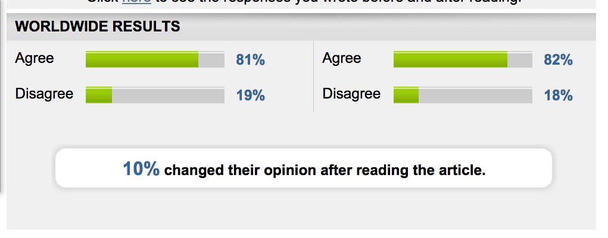

This is from my 4th grader's online homework assignment (the [achieve3000.com](https://www.achieve3000.com/) assignment on St. Augustine History, for those of you in Gainesville). For these assignments they  answer the same question before and after completing a reading and homework assignment. At the end they give you the results shown in the picture below:

\[caption id="attachment\_8537" align="aligncenter" width="1021"\] Achieve 3000 is confusing the shit outta my kids.\[/caption\]

**My response when I saw this was: "huh"?**

1) One explanation is they meant "10% of the total student pool changed their mind", e.g., 10 students changed their mind - some going from the "agree" to the "disagree" column and some going from "disagree" to "agree" column, with a net gain one one student in "agree". But that's not possible, because if you assume:

X = kids who voted "agree" in round one who voted "disagree" in round two &

Y = kids who voted "disagree" in round one and voted "agree" in round two

then you can set this up as a system of two equations with two unknowns:

81-X+Y = 82

19-Y+X = 18

that you can solve for (and only for) X = 0 and Y = 1. So only 1% of the sample could have possibly moved. This makes sense logically - there is only one combination of the sum of the numbers from 0-10 that sum to ten but have a difference of one are 0 and 1.

2) They could have meant "there was a 10% increase in the number of kids that agree" But that's obviously not true because 10% of 81 is 8.1.  89.1 != 82.

3) The only possible explanations I can imagine is that they actually meant "there was a 10% decrease in the number of kids that disagree". but even that is a mess because But 19->18 can be interpreted two ways: 1% of the total sample moved (which is correct but not 10%) or 10% of the kids in the "disagree" column changed their mind. 10% of 19 is 1.8. If this is the explanation, it only works if they round down the fraction of a kid such that: 19-1.8 = 19 - ~1 = 18.

If this is indeed their logic, this is insanely lame. "10% of the students changed their opinion" means "10% of the total number of students taking the before/after poll". They should have said "approximately 10% of the students that disagreed the first time changed their mind the second time".  

We are doomed as a nation.
