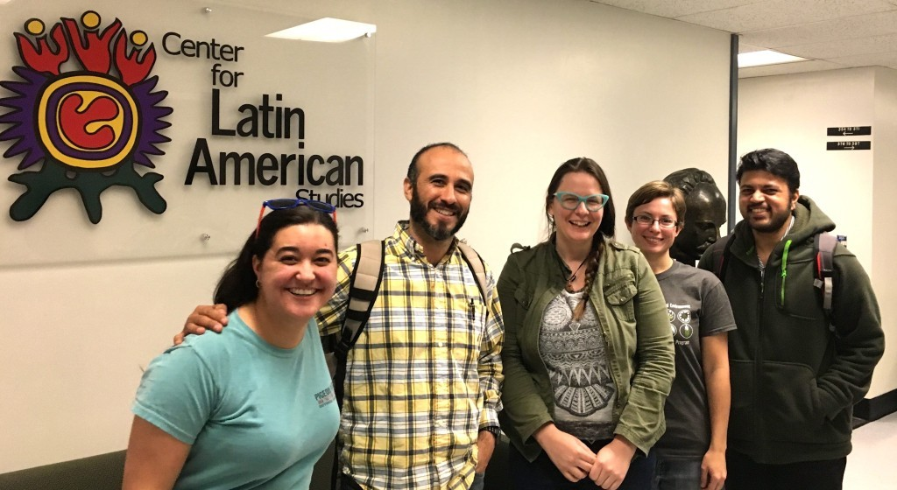

[Dr. Bette Loiselle](http://www.loisellelab.org/) and I teach a class called "[Fundraising for Tropical Conservation & Development Professionals](http://brunalab.org/las6291/)", and [one of our assignments is for students to explore the costs and benefits of crowdfunding](http://brunalab.org/las6291/individual-project/) by running a project of their own.  We learned  quite a bit from the first time we did this assignment - which by the way was a [huge success](http://brunalab.org/las6291/2014/04/10/individual-project-summary/) for us and the students - and I thought I would give a shout out to our students by letting everyone know how hard they worked and what a great job they did.  This is a repost from our [class website](http://brunalab.org/las6291/).

* * *

 

\[caption id="attachment\_9405" align="alignright" width="770"\] TCD Fundraising 2016: Mirelis, Percy, Kirsten, Dana, and Arjun (Photo: E. Bruna).\[/caption\]

 

 

 

 

 

 

 

 

 

 

 

 

 

**Our crowdfunding campaigns  have ended and our class did great!** Here are some stats:

- **Grand total: $6483** (5 projects)
- No. of Donations: 221 _(some people donated to >1 project; actual no. of donors slightly lower)_
- Average Donation: $29.33
- Projects reaching 100%: 3/5\*

Overall I would consider this a huge success. It was especially impressive because only 5 days into the month-long campaign the students got an email informing them [Rockethub](https://www.rockethub.com/) had been acquired by another company and suspended their campaigns. After a few days of frantic emails and a herculean effort by [Kym in the LAS office](http://www.latam.ufl.edu/people/staff/) Rockethub was willing to extend to the original deadline and lower the fees (\*though one of the campaigns was permanently marked as 'completed', which really hurt the student's efforts).

Congratulations to our students, and thanks to all to donors!

EB & BL

The details

**Dana Karelus**: [movement and habitat use of Florida’s bears](https://www.rockethub.com/projects/65491): $1770 by 38 funders (118%)

**Arjun Srivathsa**: [ecology and conservation of Dhole (wild dogs)](https://www.rockethub.com/projects/65481-the-dhole-project-saving-the-last-of-asia-s-wild-dogs): $2000 by 36 funders (100%)

**Mirelis Martinez:** [environmental education in Bahia, Brazil](https://www.rockethub.com/projects/64877-environmental-education-in-bahia-brazil): $55 by 4 funders\*

**Percy Peralta**: [Reforestation in the Peruvian Amazon to plant 1000 trees](https://www.rockethub.com/projects/65483-let-s-plant-1000-trees-in-the-amazon-rainforest-this-summer): $993 by 44 donors (84%)

**Kirsten Hecht** [Biology of Sirens:](https://www.rockethub.com/projects/65485-pull-over-for-sirens-researching-giant-salamanders) $1665 by 48 (116%)

\[caption id="attachment\_745" align="aligncenter" width="550"\] Photo by Dana Karelus.\[/caption\]
