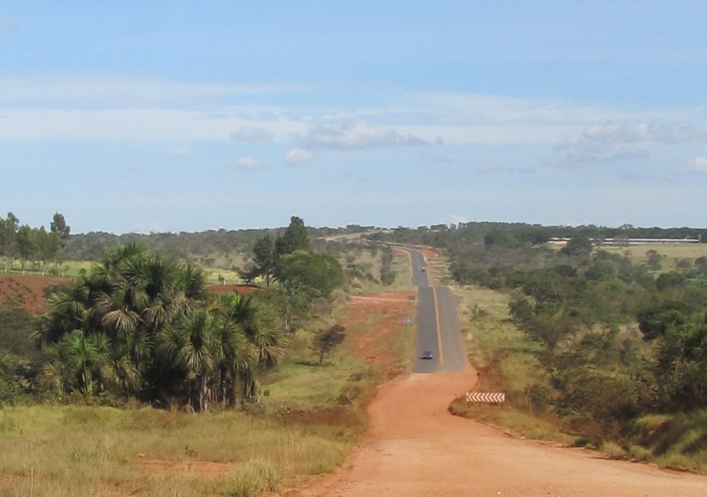
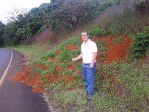
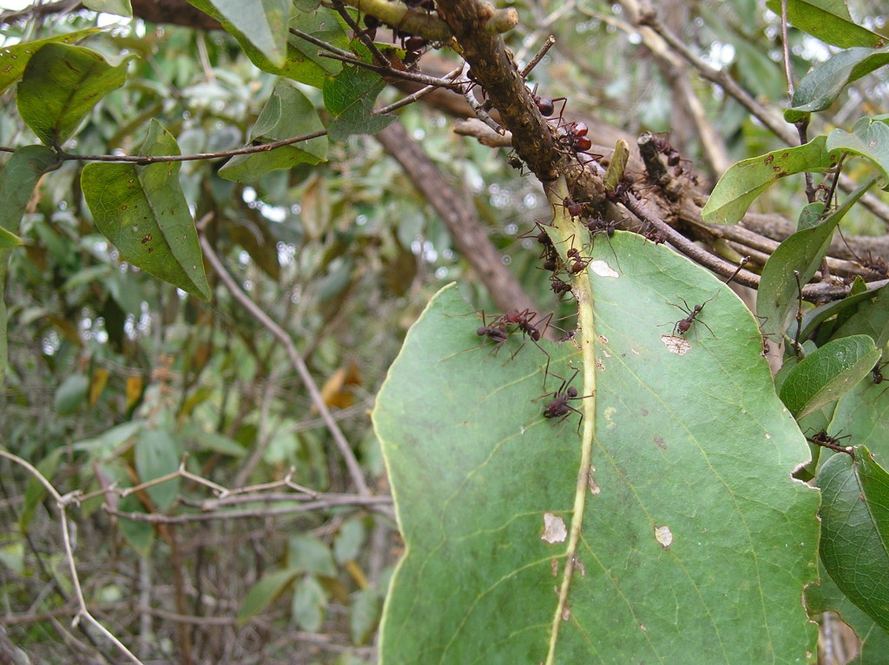
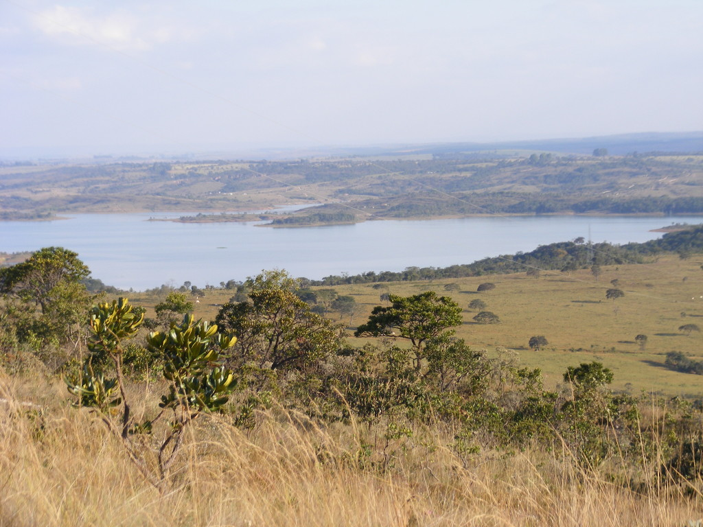
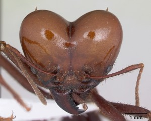

 

[The University of Florida has just pushed a press release about a paper](http://news.ufl.edu/articles/2016/04/uf-students-research-shines-a-light-on-brazilian-ecosystems.php) by our Ph.D. student Ernane Vieira Neto \[[website](https://ecologyisthefuture.com/)\]. Congratulations Ernane!

 

* * *

### **[UF student’s research shines a light on Brazilian ecosystems](http://news.ufl.edu/articles/2016/04/uf-students-research-shines-a-light-on-brazilian-ecosystems.php)**

\[caption id="attachment\_9368" align="alignright" width="500"\] Road cutting through a mixture of natural areas and agriculture in Brazil's Cerrado (Photo by Emilio Bruna).\[/caption\]

**Roads and freeways, paved or dirt, can be more than a thoroughfare for moving humans from one place to another.**

As UF researchers working in Brazil are learning and documenting, an unintended and ironic consequence of building roads for agricultural expansion is that roads can create the ideal habitat for insects that can be major agricultural pests.

[Ernane Vieira-Neto](https://ecologyisthefuture.com/), a Ph.D. candidate in [Wildlife Ecology and Conservation](http://www.wec.ufl.edu/) and a student in UF’s [Tropical Conservation and Development Program](http://www.tcd.ufl.edu/), is among biologists worldwide who are concerned about the effects on biodiversity of roads that are cutting into the heart of previously inaccessible wilderness areas.

His research, based on four years of field study, focuses on [leaf-cutter ants](http://www.alexanderwild.com/keyword/atta%20laevigata;sauva/). One of the most iconic and ecologically important species of Latin America, when their populations expand into farmer’s fields they can cause millions of dollars in crop losses each year despite widespread application of highly toxic insecticides.

\[caption id="attachment\_9355" align="alignright" width="500"\] Ernane Vieira Neto and a leaf-cutter ant nest (Atta sp.) along a roadside in Brazil. A leaf-cutter ant nest this big can consume 500 kg of plant material per year.\[/caption\]

In a [study slated for publication this month](http://onlinelibrary.wiley.com/doi/10.1111/1365-2664.12651/abstract) in the _Journal of Applied Ecology_, Vieira-Neto and his collaborators from UF’s [Center for Latin American Studies](http://www.latam.ufl.edu/) and Brazil’s [Universidade Federal de Uberlândia](http://www.ppgeco.ib.ufu.br/) – Emilio Bruna & Heraldo Vasconcelos – noted an explosion in populations of leaf-cutter ants along roadsides in the Brazilian savanna ecosystem known as the Cerrado.

A global diversity hotspot about 10 times the size of Florida, this region is responsible for Brazil’s emergence as an agricultural superpower, with approximately 4,600 miles of roads slated for construction in the next two decades.

In the paper, titled “[Roads Increase Population Growth Rates of a Native Leaf-cutter Ant in Neotropical Savannahs](http://onlinelibrary.wiley.com/doi/10.1111/1365-2664.12651/abstract),” Vieira-Neto and colleagues present data from field surveys demonstrating that the number of ant colonies next to roads increases dramatically when compared to nearby areas of native vegetation. The researchers used mathematical models to show roadsides are the ideal habitat for queens to start their new colonies, which grow very rapidly.

“For population growth, every individual colony and life stage is important,” said Vieira-Neto. “But events that occur so early in the life cycle of a leaf-cutter ant colony, such as successful colony foundation by the ant queen and colony survival as a juvenile, are more prevalent near roads and have relatively more importance for the population than late-life events.”

The researchers predicts that the increasing numbers along new roads of one of the biggest agricultural pests farmers have ever encountered could have major economic effects. In addition, because these insects also are major ecological engineers, their increased numbers will have consequences for other plant and animal species and ecosystems such as nutrient cycling.

“No matter where they are built, roads have unintended consequences for native plants and animals,” Bruna said. “Our results suggest that the impacts of roads on native biodiversity can have not only ecological impacts on other plants and animals, but potentially unexpected economic ones as well.”

**Reference:** Vieira-Neto, E. H. M., Vasconcelos, H. L., Bruna, E. M. (2016), [Roads increase population growth rates of a native leaf-cutter ant in Neotropical savannahs](http://onlinelibrary.wiley.com/doi/10.1111/1365-2664.12651/abstract). _Journal of Applied Ecology_. doi: 10.1111/1365-2664.12651

**Contact:** Ernane Vieira-Neto, [vieiraneto@ufl.edu](mailto:vieiraneto@ufl.edu) or Emilio M. Bruna [embruna@ufl.edu](mailto:embruna@ufl.edu); (352) 846-0634

 

**[Outstanding images of _Atta laevigata_](http://www.alexanderwild.com/keyword/atta%20laevigata;sauva/) like the one used as the featured image on our web page can be obtained from Alex Wild. _Please note his [policy on image use, including in press releases](http://www.alexanderwild.com/Image-Use)._** 

 

\[caption id="attachment\_9353" align="alignleft" width="500"\] The focal species of Vieira-Neto's study is the leaf-cutter ant _Atta laevigata_ (Photo by Fabiane Mundim).\[/caption\]

\[caption id="attachment\_9354" align="alignright" width="500"\] With an original area of 2 million square km, the Cerrado is Brazil's second largest biome. Because it is central to Brazil's agricultural industry, it has a large and rapidly growing road network (Photo by Fabiane Mundim).\[/caption\]

 

 

 

 

 

 

 

 

 

 

 

 

 

\[caption id="attachment\_9377" align="aligncenter" width="500"\] Atta laevigata (Photo by April Nobile / © AntWeb.org / CC-BY-SA-3.0).\[/caption\]
