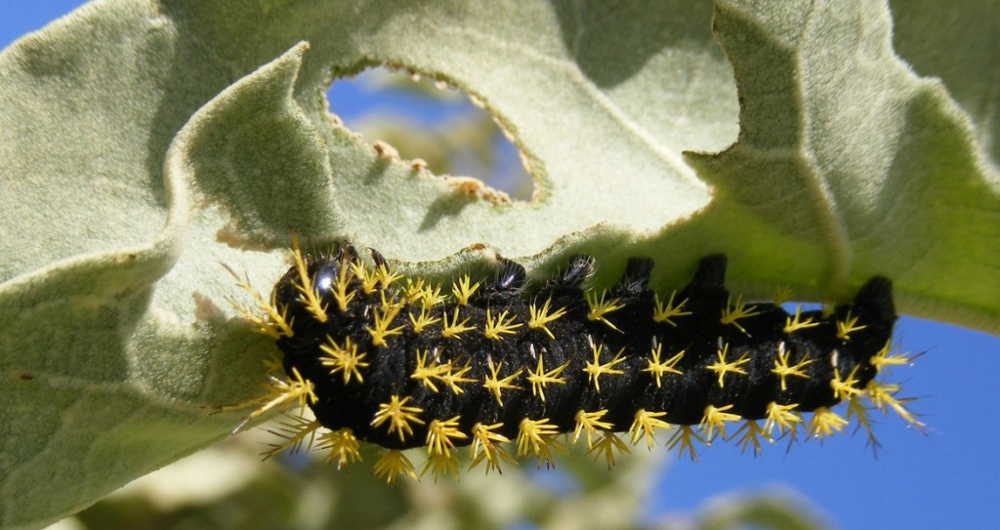

in 2015 the American Society of Naturalists, Society of Systematic Biologists, and Society for the Study of Evolution had their [joint meeting in Brazil](http://evolution2015.org/) - the first time this meeting was held in the tropics. At the time the [Marlene Zuk](http://cbs.umn.edu/contacts/marlene-zuk) was [ASN Vice-President,](http://www.amnat.org/home.html) and she had a brilliant idea for the traditional VP's symposium that took advantage of the meeting being held in Brazil: examining "Temperate Assumptions". In outher words, how our ideas about ecology, evolution and behavior have been shaped, and perhaps biased, by the places many scientists historically worked - the temperate regions of the world, especially Europe and North America. Her goal was to have speakers re-examine the assumptions and the examples used and discuss how our ideas and theory would be enriched by a consideration of other systems, taxa, and viewpoints.

\[caption id="attachment\_6977" align="alignright" width="300"\] Fabiane Mundim (photo by Ernane Vieira Neto)\[/caption\]

The invitation to participate coincided perfectly with some work my PhD student [Fabiane Mundim](https://scholar.google.com/citations?user=sIRvQzQAAAAJ&hl=en) had recently completed. Fabiane was interested in doing her thesis work on how climate change would influence plant-herbivore interactions, especially in the tropics. To get me up to speed on the topics my students choose for their thesis we try and do a review or meta-analysis together, so Fabiane started reviewing experimental work investigating if plant-herbivore interactions were altered by different types of environmental changes associated with changing climates. The results were really interesting, and there was a strong tropical-temperate bias, so we put together a talk and I presented the results in the symposium (Fabiane couldn't make it as she was in the throes of field work). A video of the presentation is [here](https://www.youtube.com/watch?v=OT3Jj9NUUS0); if you are interested in the data on what is being published in _AmNat_ and the location of the authors you can find the data on [Figshare](https://figshare.com/articles/American_Naturalist_Publications_and_Author_Home_Countries_1900_2015_/1466772) and code to make the maps on [Github](https://github.com/embruna/Bruna.Mundim.ASN.2015)).

Fast forward a year later and the [Special Issue of the _American Naturalist_ based on the symposium is out](http://www.journals.uchicago.edu/toc/an/2016/188/S1). You can find [Fabiane's meta-analysis](http://brunalab.org/wp-content/uploads/2016/09/MundimBruna_2016_AmNat.pdf) as well as papers on topics ranging from the macroecology of sexual selection to the biogeography of biogeochemistry - lots to think about in all the papers.  As for Fabiane's study, I think it points out some really important shortcomings in both the theoretical frameworks used to study plant-herbiovre interactions in a changing world as well as the data needed to address this issue:

> Empirical studies were heavily biased toward temperate systems, so testing predicted changes in tropical plant-herbivore interactions was virtually impossible. Furthermore, most studies investigated the effects of CO2 with limited plant and herbivore species. Irrespective of location, most studies manipulated only one climate change factor despite the fact that different factors can act in synergy to alter responses of plants and herbivores. Finally, studies of belowground plant-herbivore interactions were also rare; those conducted suggest that climate change could have major effects on belowground subsystems.

In sum, our results suggest that there is a major disconnection between the literature proposing how climate change will influence plant-herbivore interactions and the studies testing these predictions. If there are students looking for thesis projects, [I think this is paper is a gold mine](http://brunalab.org/wp-content/uploads/2016/09/MundimBruna_2016_AmNat.pdf).

Congratulations Fabiane!

Fabiane M. Mundim and Emilio M. Bruna. 2016. [Is There a Temperate Bias in Our Understanding of How Climate Change Will Alter Plant-Herbivore Interactions? A Meta-analysis of Experimental Studies](http://brunalab.org/wp-content/uploads/2016/09/MundimBruna_2016_AmNat.pdf). _The American Naturalist_ 188, no. S1: S74-S89.

\[caption id="attachment\_1492" align="aligncenter" width="770"\] Caterpillar eating one of the species studied by our lab - the Cerrado's famous Solanum lycocarpum, whose fruits are dispersed by Maned Wolves (Chrysocyon brachyurus). Photo by F. Mundim.\[/caption\]

Featured Image: Caterpillar munching on a _Solanum_ in Brazil's Cerrado (by F. Mundim)
