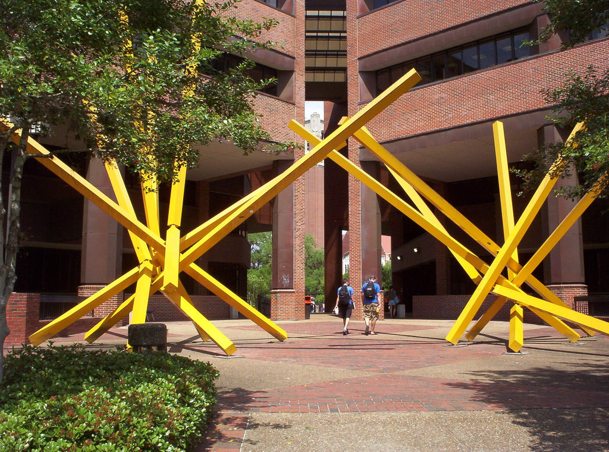

\[caption id="attachment\_10359" align="aligncenter" width="770"\] Marston Science Library (Photo by [Random McRandomhead](https://www.flickr.com/photos/johnjack/356328323/in/photolist-xugZM-GkBfWy-H7NiCw-gQQBdB-86YuwA-HdbQVm-gQRZpg-8QB5om-8QB5m7-aJkea-GkKP6g-gQS9ow-gQS4zJ-HddUmW-gQRqmH-gQS1VH-gQSggX-7WfXDe-gQRURZ-gQRkqm-gQRzXN-gQRGba-gQSuP8-gQRRU7-gQS2ky-gQRux9-gQQXav-gQQNyo-gQRiUW-gQRjLf-gQRUdq-gQS2TW-fgAN8c-gQSdZW-gQQTaM-gQRvhB-gQRQ4n-7Wjeou-gQRoys-gQRJAb-gQRign-gQQLWW-gQS5tg-gQRSFN-gQRd3g-gQRmwR-gQS7UX-gQSBCD-gQSY9D-gQRDFi), CC BY 2.0)\[/caption\]

A little over a year ago, Christine Fruin (UF Scholarly Communications Librarian) put together a task force to try and assess the needs across campus with respect to scholarly communications issues (e.g., author’s rights, fair use, open educational resources, public access to federally funded research) and to promote collaboration in addressing and informing policies. One of the big issues the task force identified right away was a need to convince the administration to  reinstate the **Open Access Publishing Fund**, which allowed faculty and students to defray the costs of publishing OA**. It wasn't easy, but we did it - the UF OA Publishing Fund has been Reinstated!** This is a great news for those of us at UF trying to promote OA publication. The details on [how to apply for funding are here](http://cms.uflib.ufl.edu/ScholComm/UFOAPF).  If interested you can see some data we prepared for the Provost on previous use of these funds [here](http://brunalab.org/wp-content/uploads/2016/11/UFOAP_Summary_March2016.pdf) (the code to make them are on a [GitHub repo](https://github.com/embruna/UF-OA-Fund), I'll try to get the data online soon).

* * *

The George A. Smathers Libraries are very pleased to announce the reinstatement of the University of Florida Open Access Publishing (UFOAP) Fund. Thanks to the financial commitment of the Office of the Provost and the endorsement of the Faculty Senate Research and Scholarship Council, funding of $120,000/year for four years has been committed to support open access publishing by UF faculty, staff and students.

The UFOAP Fund will begin accepting applications [on January 1, 2017](http://airmail.calendar/2017-01-01%2012:00:00%20EST). Faculty, graduate students, staff and post-doctoral researchers who are the first named or corresponding author of open access scholarly articles accepted for publication [after November 15, 2016](http://airmail.calendar/2016-11-15%2012:00:00%20EST) and who do not have access to funding through grants or other financial means of support will be eligible to apply for financial assistance in paying article processing charges assessed by open access journals.

For more information on eligibility criteria including eligible publications and required documentation for applications, please review the UFOAP Fund Policies and Procedures at [http://cms.uflib.ufl.edu/scholcomm/UFOAPF](http://cms.uflib.ufl.edu/scholcomm/UFOAPF). Questions about the UFOAP Fund and open access may be sent to the Scholarly Communications Librarian, Christine Fruin, at [christine.fruin@uflib.ufl.edu](mailto:christine.fruin@uflib.ufl.edu).

* * *
