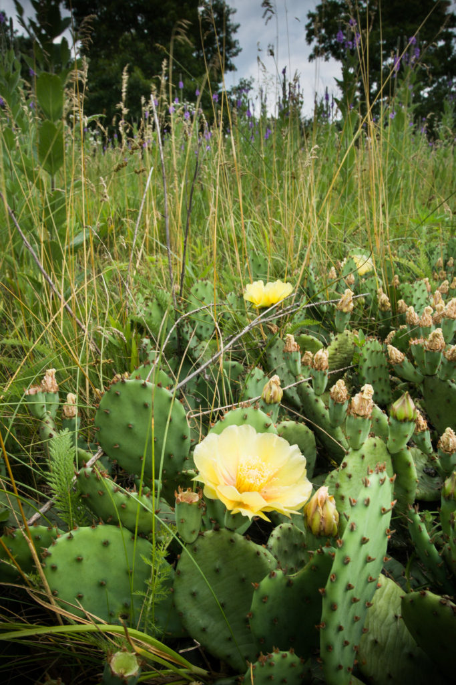
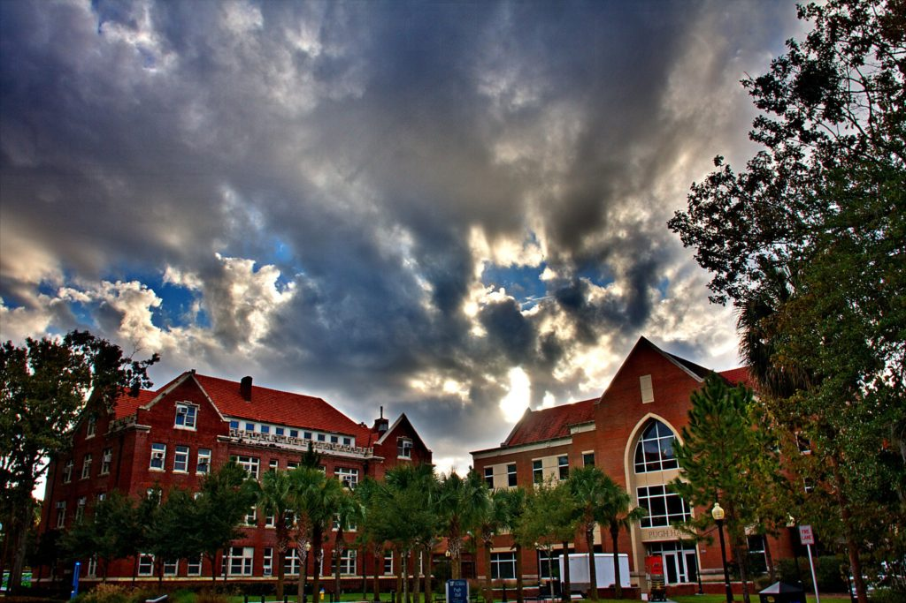

_**NB: position filled, but leaving up for the lab archive.**_

**We are seeking a highly motivated Ph.D. student to start at the [University of Florida](http://www.ufl.edu/) in Fall 2017.** This student will work as part of a

\[caption id="attachment\_10873" align="alignright" width="400"\] Opuntia photo by Justin Meissen (CC BY-SA 2.0)\[/caption\]

collaborative research group on a project investigating the role of on habitat loss, habitat fragmentation, and matrix quality on the population and community dynamics of insect herbivores. The project includes field work at the nearby [Ordway-Swisher Biological Station](http://www.osbs.ufl.edu), including experiments manipulating habitatand matrix types, using prickly-pear cactus and their associated species as a model system (see, e.g., [Fletcher et al. 2011, 2013, 2014](http://plaza.ufl.edu/robert.fletcher/publications.html)). The project includes four years of full support for the student (approximately $22,500/year, plus health benefits; pending final approval), funds for field work, and support for some travel to meetings. An additional year of support may be available to outstanding candidates from the graduate program via which the student matriculates (see below).

The student will be co-advised by [Dr. Robert Fletcher](http://plaza.ufl.edu/robert.fletcher/) and [Dr. Emilio Bruna](http://brunalab.org/). Other collaborators on the project include [Dr. Bob Holt](http://people.clas.ufl.edu/rdholt/) and Dr. Brian Reichert. Preferred applicants will be highly motivated and have a background in ecology, entomology, or other relevant field, field experience, strong quantitative skills (preferably in population or spatial ecology), and an ability to work well both independently and with as part of a diverse team. Interested students should send a (1) a letter of interest describing your educational background, research experience, and career goals, (2) a  Curriculum Vitae that includes GRE and TOEFL/TSE scores (if relevant) and GPA (3) an unofficial copy of transcripts and (4) contact information for three references by email to Dr. Robert Fletcher (email: [robert.fletcher@ufl.edu](mailto:robert.fletcher@ufl.edu)). The deadline for submitting materials for review is February 1, 2017. Interested applicants should also apply to the Graduate Programs in [Wildlife Ecology and Conservation](http://www.wec.ufl.edu/grad) and the [School of Natural Resources and the Environment](http://snre.ufl.edu), both of which accommodate students studying a broad diversity of topics in ecology and conservation. Students to these programs may also apply for an additional year of stipend and tuition support. More information is [here](http://plaza.ufl.edu/robert.fletcher/).

**Information about the City of Gainesville**:

Situated in the rolling countryside of north central Florida, Gainesville is much more than a stereotypical college town. Home of the University of Florida, seat of Alachua County's government and the region's commercial hub, it is progressive, environmentally conscious and culturally diverse. The presence of many students and faculty from abroad among its 99,000-plus population adds a strong cross-cultural flavor to its historic small-town Southern roots. Its natural environment, temperate climate and civic amenities make Gainesville a beautiful, pleasant and interesting place in which to learn and to live. Gainesville has been ranked as one of the best cities to live in the United States.

Florida boasts a diversity of fauna and flora common to both southern temperate and subtropical climates and is replete with springs, rivers, backwater streams, lakes, freshwater and saltwater marshes, mangrove fringes, cypress swamps, hardwood hammocks, sandhills, scrub, pine flatwoods, and rangeland. Nested between the Atlantic Ocean and the Gulf of Mexico, Florida has more than 2,000 kilometers of coastal beaches and estuaries. Special features include the Florida Keys, which constitute an archipelago of picturesque subtropical islands, and the unique Everglades, or “river of grass,” which sprawls across the vast southern peninsula.

**Information about the University of Florida**: [The University of Florida](http://www.ufl.edu) is a Land-Grant, Sea-Grant, and Space-Grant institution, encompassing virtually all academic and professional disciplines, with an enrollment of more than 50,000 students. The nearby 3,600-hectare Ordway-Swisher Biological Station, managed by the UF Department of Wildlife Conservation and Ecology, provides an outdoor laboratory for teaching and a site for long-term field research, and has been designated to serve as a National Science Foundation NEON core site.

Several units on or nearby the University of Florida campus complement the teaching and research programs of the Department, including The Florida Climate Institute, an interdisciplinary center hosted at UF and comprising 7 Florida universities; Biotechnologies for Ecological, Evolutionary, and Conservation Sciences; the Tropical Conservation and Development Program in the Center for Latin American Studies; Center for Natural Resources; Center for Wetlands; Center for Biological Conservation; Pre-eminence initiatives in Bioinformatics and Biodiversity; Florida Museum of Natural History; Northeast Regional Data Center; National Ecology Laboratory (Sirenia) of USGS; Florida Field Station (Gainesville) of the U.S.D.A. Wildlife Research Laboratory; Southeastern Forest Experiment Station unit of the U.S. Forest Service; The Nature Conservancy; the Wildlife Conservation Society; the Wildlife Research Laboratory of the Florida Fish and Wildlife Conservation Commission; and others.

\[caption id="attachment\_10874" align="aligncenter" width="770"\] "EmptyCampus" by Wabisabi2015 (CC BY-NC-ND)\[/caption\]
