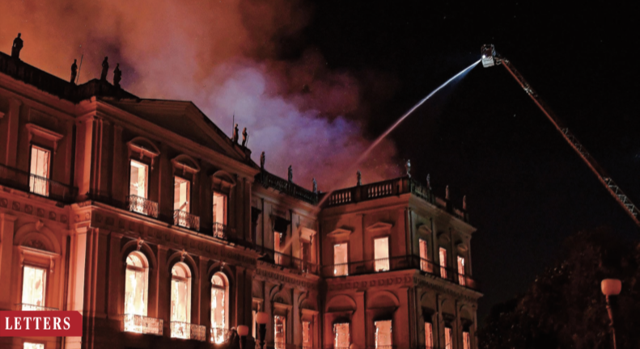

On 2 September, the world watched in horror as Brazil’s National Museum, housing a vast collection of more than 20 million biodiversity and cultural artifacts, was engulfed in flames. [A link to our Letter in _Science_ about this tragedy is here](http://brunalab.org/wp-content/uploads/2018/11/Zamudio_etal_2018_Science.pdf).

\[caption id="attachment\_21738" align="aligncenter" width="791"\]  \[/caption\]
