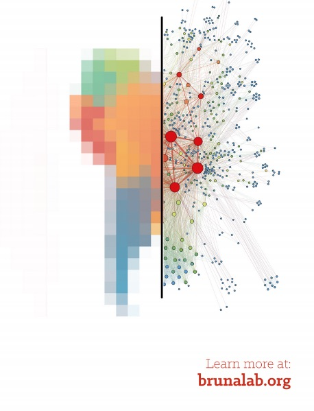
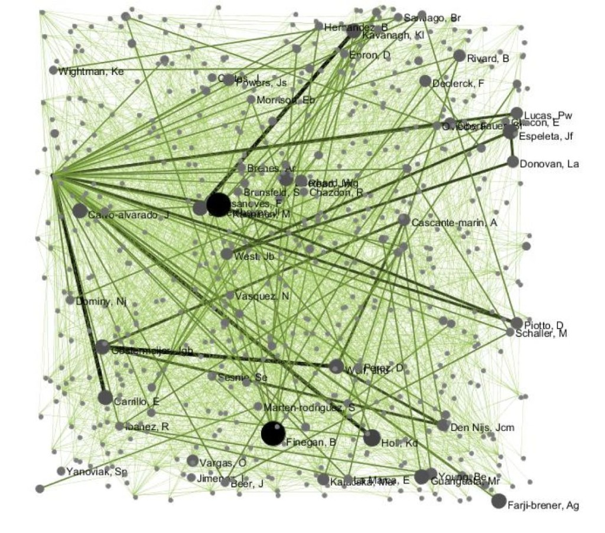

* * *

**Overview:** [The Bruna Lab](http://brunalab.org/) at the [University of Florida](http://www.ufl.edu/) is recruiting a Master's student with an interest in scientometrics, metascience, or social network analysis to become part of an emerging research group in Latin American Science and Science Policy based in the [Center for Latin American Studies](http://www.latam.ufl.edu/). The selected student will enroll in Fall Semester 2020 through of the multidisciplinary [Master of Arts in Latin American Studies](http://www.latam.ufl.edu/) (MALAS) program and will have two years of financial support (tuition, health insurance, and annual stipends of $15,500). The selected student will have broad latitude in choosing the topic of their thesis research, but _we are especially interested in candidates interested in studying_ **(1)** the demographic factors (e.g., gender, career stage, institutional affiliation, nationality) influencing the productivity and impact of scientists in Latin America, **(2)** the impact of and factors underlying engagement in collaborative research, including both within-country and international collaboration, and how this can help guide national science funding policy, and **(3)** evaluating the  impact of recent Latin American capacity building initiatives (e.g., Brazil's Science Without Borders Program).  Regardless of the project, we encourage considering both traditional and alternative metrics of productivity. The student will also have the opportunity to work with and learn from partners such as the UF [Informatics Institute](https://informatics.institute.ufl.edu/), the UF [Collaboration Networks Group](https://www.bebr.ufl.edu/networks), the spectacular resources and faculty of the [UF Smathers Library](http://cms.uflib.ufl.edu/), and our collaborators at other institutions.

**Qualifications:** Given the multidisciplinary nature of the project and MALAS program, we will consider graduates from any undergraduate program that can clearly articulate why they want to pursue research and training in this area. However, applicants with prior course work in relevant fields (e.g., scientometrics, library science, information science, gender studies, public policy, sociology, anthropology) are especially encouraged to apply. Quantitative skills, such as a coursework in statistics, experience with social network analysis, and the ability to manipulation and analyze data using R, or a willingness to learn them, are also highly desired.

**Application Process:** _Please contact us as soon as possible if you are interested in this opportunity_. Review the MALAS program \[[overview](http://www.latam.ufl.edu/academics/graduate-programs/malas/), [information sheet](http://www.latam.ufl.edu/media/ufledu/content-assets/latamufledu/academics-tuesday-november-04-2014-21304-pm/graduate-programs/MALAS-Program-Information-Sheet.pdf), [requirements and application information](http://www.latam.ufl.edu/academics/graduate-programs/malas/malas-application/)\] and some of our prior publications \[[link](http://brunalab.org/latin-american-science-science-policy/)\], then send an email to Dr. Emilio Bruna  ([embruna@ufl.edu](mailto:embruna@ufl.edu)) with the following information:

1. A brief description of your research interests
2. A summary of relevant coursework and research experience
3. A _Curriculum Vitae_

**The deadline for applying to the MALAS Program is February 1, 2021** \[[MALAS Application Information](http://www.latam.ufl.edu/academics/graduate-programs/malas/malas-application/)\]. If you are an applicant from a foreign country, the process of applying can be time consuming because it requires translating documents, studying for and taking the GRE, TOEFL, etc.  **Start now.** Here are some resources you may fund useful:

- [UF Graduate School Page for International Applicants](http://graduateschool.ufl.edu/admissions/international-applicants/)
- [UF Graduate School Brochure in Portuguese](http://www.floridabrazil.org/wp-content/uploads/2015/04/UF-international-admissions-brochure-portuguese.pdf)
- [MALAS Application Process](http://www.latam.ufl.edu/academics/graduate-programs/malas/malas-application/)
- There are many student organizations whose members can provide insights on the process (e.g. [UF BRASA (Brazilian Student Organization)](https://www.facebook.com/brasa.uf/), [Mexicans in Gainesville Student Organization](https://ufl.collegiatelink.net/organization/mig/about)). You can [search the organization directory here](https://ufl.collegiatelink.net/organizations?SearchType=None&CurrentPage=1&Filters=GroupSearchOnMyInterests) for more (start by clicking the link for "categories" then "Cultural").

 

 Coauthorship network of all articles in 55 ecological journals from 2010-2010 that include at least one coauthor from Costa Rica (Bruna & Hahn, unpubl. data).

 

#### The UF Center for Latin American Studies

The [UF Center for Latin American Studies](http://www.latam.ufl.edu/) is the oldest and one of the largest Latin American Studies programs in the United States. The Latin American program was formed in the 1930s and renamed the Center for Latin American Studies in 1963. It was among the first institutions in the country to be designated a National Resource Center by the U.S. Department of Education (USDE) and to receive assistance through fellowships and the USDE’s Title VI program. Today, the Center is ranked among the best in the world, and UF libraries host a world-class collection of Latin American and Caribbean materials. Students can choose from among 350 Latin American and Caribbean area and language courses routinely offered by 50 departments at UF.
